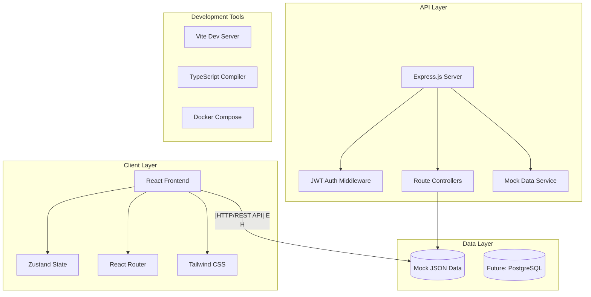

# MyCafe Reservation System - Architecture Documentation

## System Overview

MyCafe is a comprehensive cafe reservation system built with a modern full-stack architecture, enabling users to discover cafes, book seats, and manage reservations in real-time.

### High-Level Architecture



## Technology Stack

### Frontend (Client)
- **Framework**: React 18 with TypeScript
- **Build Tool**: Vite (fast development and optimized builds)
- **Styling**: Tailwind CSS + shadcn/ui components
- **State Management**: Zustand (lightweight alternative to Redux)
- **Routing**: React Router v6
- **Forms**: React Hook Form + Zod validation
- **HTTP Client**: Axios with interceptors
- **Development**: ESLint, Prettier

### Backend (Server)
- **Runtime**: Node.js with Express.js
- **Language**: TypeScript
- **Authentication**: JWT tokens + bcrypt password hashing
- **File Upload**: multer middleware
- **Validation**: Zod schemas
- **CORS**: Express CORS middleware
- **Development**: tsx for TypeScript execution

### Development & Deployment
- **Package Manager**: npm
- **Containerization**: Docker + Docker Compose
- **Development Server**: Concurrent frontend/backend execution
- **Build Process**: TypeScript compilation + Vite bundling

## System Components

### 1. Frontend Architecture

```
client/
├── src/
│   ├── components/          # Reusable UI components
│   │   ├── ui/             # shadcn/ui base components
│   │   ├── layout/         # Layout components (Header, Footer)
│   │   ├── forms/          # Form components
│   │   └── cafes/          # Cafe-specific components
│   ├── pages/              # Page components (route handlers)
│   ├── stores/             # Zustand state stores
│   ├── services/           # API service layer
│   ├── hooks/              # Custom React hooks
│   ├── utils/              # Utility functions
│   ├── types/              # TypeScript type definitions
│   └── constants/          # Application constants
```

#### State Management Strategy
- **Zustand Stores**: Lightweight, no boilerplate
- **Persistence**: LocalStorage for auth tokens
- **Separation of Concerns**: Separate stores for auth, UI, data

#### Routing Structure
- `/` - Home page
- `/cafes` - Cafe listing and search
- `/cafes/:id` - Cafe detail page
- `/my-reservations` - User's reservation management
- `/auth/login` - Authentication
- `/auth/register` - User registration
- `/admin/*` - Admin dashboard (role-based access)

### 2. Backend Architecture

```
server/
├── src/
│   ├── routes/             # API route definitions
│   │   ├── auth-mock.ts    # Authentication endpoints
│   │   ├── cafes-mock.ts   # Cafe CRUD operations
│   │   └── reservations-mock.ts # Reservation management
│   ├── middleware/         # Express middlewares
│   │   ├── auth.ts         # JWT validation
│   │   ├── cors.ts         # CORS configuration
│   │   └── upload.ts       # File upload handling
│   ├── utils/              # Utility functions
│   ├── types/              # Shared TypeScript types
│   └── app.ts              # Express app configuration
```

#### API Design Principles
- **RESTful conventions**: Standard HTTP methods and status codes
- **Consistent response format**: Unified success/error responses
- **Authentication**: JWT-based stateless authentication
- **Validation**: Request/response validation with Zod schemas

### 3. Data Layer

#### Current: Mock Data Implementation
- **Location**: `server/src/routes/*-mock.ts`
- **Format**: In-memory JavaScript objects
- **Persistence**: None (resets on server restart)
- **Purpose**: Development and testing

#### Future: Database Integration
- **Primary DB**: PostgreSQL with Prisma ORM
- **Schema**: Normalized relational design
- **Migrations**: Prisma migration system
- **Seeding**: Automated test data generation

## Data Models

### Core Entities

#### User
```typescript
interface User {
  id: string
  email: string
  name: string
  phone?: string
  password: string // hashed with bcrypt
  role: 'USER' | 'ADMIN' | 'CAFE_OWNER'
  isActive: boolean
  createdAt: string
  updatedAt: string
}
```

#### Cafe
```typescript
interface Cafe {
  id: string
  name: string
  description: string
  address: string
  phone: string
  latitude: number
  longitude: number
  images: string[] // Unsplash URLs
  amenities: string[]
  businessHours: BusinessHours
  pricePerHour: number
  maxReservationHours: number
  priceRange: 'LOW' | 'MEDIUM' | 'HIGH'
  isActive: boolean
  rating: number
  reviewCount: number
  ownerId: string
  owner: CafeOwner
  createdAt: string
  updatedAt: string
}
```

#### Reservation
```typescript
interface Reservation {
  id: string
  userId: string
  cafeId: string
  seatId: string
  startTime: string
  endTime: string
  totalHours: number
  totalPrice: number
  status: 'PENDING' | 'CONFIRMED' | 'CANCELLED' | 'COMPLETED'
  paymentStatus: 'PENDING' | 'PAID' | 'REFUNDED'
  createdAt: string
  updatedAt: string
}
```

## Authentication & Authorization

### JWT Token Strategy
- **Access Tokens**: Short-lived (7 days default)
- **Token Storage**: Client-side localStorage
- **Token Refresh**: Manual re-authentication
- **Payload**: User ID, email, role, expiration

### Role-Based Access Control (RBAC)
- **USER**: Basic cafe discovery and reservation
- **CAFE_OWNER**: Manage owned cafes and reservations
- **ADMIN**: Full system management access

### Security Measures
- **Password Hashing**: bcrypt with salt rounds
- **JWT Secrets**: Environment variable configuration
- **CORS**: Configured for frontend domain
- **Input Validation**: Zod schema validation
- **Rate Limiting**: Planned for production

## API Endpoints

### Authentication Routes
```
POST /api/auth/register     # User registration
POST /api/auth/login        # User login
GET  /api/auth/me          # Get current user profile
POST /api/auth/logout      # User logout
```

### Cafe Routes
```
GET    /api/cafes           # List cafes with filtering/pagination
GET    /api/cafes/:id       # Get cafe details
GET    /api/cafes/:id/seats # Get available seats for cafe
GET    /api/cafes/search    # Advanced cafe search
POST   /api/cafes          # Create cafe (admin/owner only)
PUT    /api/cafes/:id      # Update cafe (admin/owner only)
DELETE /api/cafes/:id      # Delete cafe (admin only)
```

### Reservation Routes
```
GET    /api/reservations           # List user reservations
POST   /api/reservations           # Create reservation
GET    /api/reservations/:id       # Get reservation details
PUT    /api/reservations/:id       # Update reservation
DELETE /api/reservations/:id       # Cancel reservation
```

## Error Handling Strategy

### Standardized Error Responses
```typescript
interface ErrorResponse {
  success: false
  error: {
    code: string
    message: string
    details?: any
  }
}
```

### Error Categories
- **Validation Errors**: 400 Bad Request
- **Authentication Errors**: 401 Unauthorized
- **Authorization Errors**: 403 Forbidden
- **Not Found Errors**: 404 Not Found
- **Server Errors**: 500 Internal Server Error

## Performance Considerations

### Frontend Optimization
- **Code Splitting**: React.lazy() for route-based splitting
- **Image Optimization**: Unsplash URLs with size parameters
- **State Optimization**: Zustand subscriptions
- **Bundle Analysis**: Vite bundle analyzer

### Backend Optimization
- **Response Compression**: gzip middleware
- **Caching Strategy**: Planned Redis integration
- **Database Optimization**: Indexed queries, connection pooling
- **API Rate Limiting**: Planned implementation

### Development Performance
- **Hot Module Replacement**: Vite HMR
- **TypeScript**: Incremental compilation
- **Concurrent Development**: Frontend/backend parallel execution

## Deployment Architecture

### Development Environment
```
Docker Compose Services:
├── frontend (React + Vite)
├── backend (Node.js + Express)
├── database (PostgreSQL - planned)
└── redis (Caching - planned)
```

### Production Considerations
- **Container Orchestration**: Docker Swarm or Kubernetes
- **Load Balancing**: Nginx reverse proxy
- **Database**: Managed PostgreSQL service
- **File Storage**: AWS S3 or similar
- **Monitoring**: Application and infrastructure monitoring
- **CI/CD**: Automated testing and deployment pipeline

## Testing Strategy

### Frontend Testing
- **Unit Tests**: React Testing Library + Jest
- **Component Tests**: Storybook integration
- **E2E Tests**: Playwright (planned)
- **Visual Regression**: Chromatic (planned)

### Backend Testing
- **Unit Tests**: Jest
- **Integration Tests**: Supertest
- **API Testing**: Automated endpoint validation
- **Load Testing**: Artillery or K6 (planned)

## Monitoring & Observability

### Application Monitoring
- **Error Tracking**: Sentry integration (planned)
- **Performance Monitoring**: Application metrics
- **User Analytics**: Usage pattern tracking
- **Business Metrics**: Reservation conversion rates

### Infrastructure Monitoring
- **Server Metrics**: CPU, memory, disk usage
- **Database Performance**: Query performance, connection pools
- **API Metrics**: Response times, error rates
- **Uptime Monitoring**: Service availability tracking

## Security Architecture

### Client-Side Security
- **XSS Protection**: React's built-in protections
- **CSRF Protection**: SameSite cookie attributes
- **Content Security Policy**: Configured headers
- **Dependency Scanning**: npm audit integration

### Server-Side Security
- **Input Sanitization**: Zod schema validation
- **SQL Injection Prevention**: Parameterized queries
- **Authentication**: JWT with proper expiration
- **Authorization**: Role-based access control
- **Rate Limiting**: API endpoint protection
- **HTTPS**: SSL/TLS encryption (production)

## Scalability Considerations

### Horizontal Scaling
- **Stateless Design**: JWT-based authentication
- **Database Sharding**: User-based partitioning
- **Microservices**: Service decomposition (future)
- **CDN Integration**: Static asset distribution

### Vertical Scaling
- **Database Optimization**: Query optimization, indexing
- **Caching Layers**: Redis for frequently accessed data
- **Connection Pooling**: Database connection management
- **Resource Monitoring**: Automated scaling triggers

---

This architecture supports the current MVP requirements while providing a foundation for future scalability and feature expansion.