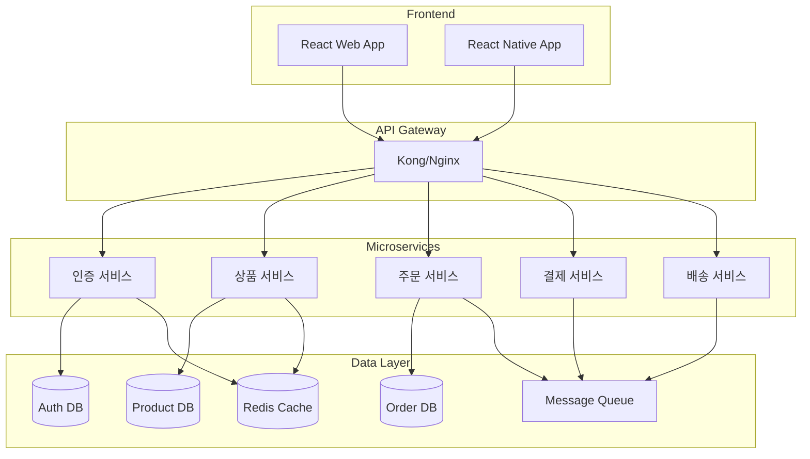

# 온라인 쇼핑몰 마이크로서비스 아키텍처 설계

## 프로젝트 개요

본 프로젝트는 현대적인 마이크로서비스 아키텍처 패턴을 적용한 확장 가능한 온라인 쇼핑몰 시스템입니다. 각 서비스는 독립적으로 개발, 배포, 확장이 가능하며, 느슨한 결합(loose coupling)과 높은 응집도(high cohesion)를 유지합니다.

## 주요 설계 원칙

### 1. Domain-Driven Design (DDD)
- 각 마이크로서비스는 명확한 비즈니스 도메인을 담당
- 서비스 간 경계는 비즈니스 로직을 기준으로 설정
- 도메인별 독립적인 데이터베이스 운영

### 2. API-First 접근방식
- 모든 서비스는 RESTful API로 통신
- OpenAPI/Swagger 스펙 기반 문서화
- 버전 관리를 통한 하위 호환성 보장

### 3. 이벤트 드리븐 아키텍처
- 비동기 처리가 필요한 작업은 메시지 큐 활용
- 서비스 간 직접 의존성 최소화
- 최종 일관성(Eventual Consistency) 패턴 적용

## 아키텍처 다이어그램

## 서비스별 상세 설계

### 1. 인증 서비스 (Authentication Service)

**책임 영역:**
- 사용자 회원가입, 로그인, 로그아웃
- JWT 토큰 발급 및 검증
- 사용자 프로필 관리
- 권한 관리 (RBAC)

**기술 스택:**
- Node.js/Express.js
- PostgreSQL (사용자 정보)
- Redis (세션 캐시)
- JWT (토큰 기반 인증)
- bcrypt (비밀번호 해싱)

**API 엔드포인트:**
- `POST /auth/register` - 회원가입
- `POST /auth/login` - 로그인
- `POST /auth/logout` - 로그아웃
- `GET /auth/profile` - 프로필 조회
- `PUT /auth/profile` - 프로필 수정
- `POST /auth/refresh` - 토큰 갱신

### 2. 상품 서비스 (Product Service)

**책임 영역:**
- 상품 CRUD 관리
- 카테고리 관리
- 재고 관리
- 상품 검색 및 필터링

**기술 스택:**
- Node.js/Express.js
- MongoDB (상품 정보)
- Redis (검색 캐시)
- Elasticsearch (검색 엔진)

**API 엔드포인트:**
- `GET /products` - 상품 목록 조회
- `GET /products/:id` - 상품 상세 조회
- `POST /products` - 상품 등록 (관리자)
- `PUT /products/:id` - 상품 수정 (관리자)
- `DELETE /products/:id` - 상품 삭제 (관리자)
- `GET /categories` - 카테고리 목록

### 3. 주문 서비스 (Order Service)

**책임 영역:**
- 주문 생성 및 관리
- 주문 상태 추적
- 재고 예약 및 확정
- 주문 이력 관리

**기술 스택:**
- Node.js/Express.js
- PostgreSQL (주문 정보)
- RabbitMQ (이벤트 발행)

**API 엔드포인트:**
- `POST /orders` - 주문 생성
- `GET /orders` - 주문 목록 조회
- `GET /orders/:id` - 주문 상세 조회
- `PUT /orders/:id/cancel` - 주문 취소

**발행 이벤트:**
- `order.created` - 주문 생성 시
- `order.cancelled` - 주문 취소 시

### 4. 결제 서비스 (Payment Service)

**책임 영역:**
- 결제 처리 및 검증
- 환불 처리
- 결제 수단 관리
- 외부 결제 게이트웨이 연동

**기술 스택:**
- Node.js/Express.js
- PostgreSQL (결제 정보)
- Stripe/KG이니시스 (결제 게이트웨이)

**API 엔드포인트:**
- `POST /payments` - 결제 요청
- `GET /payments/:id` - 결제 상세 조회
- `POST /payments/:id/refund` - 환불 요청

**구독 이벤트:**
- `order.created` - 결제 준비
- `order.cancelled` - 결제 취소

**발행 이벤트:**
- `payment.completed` - 결제 완료 시
- `payment.failed` - 결제 실패 시

### 5. 배송 서비스 (Shipping Service)

**책임 영역:**
- 배송 정보 관리
- 배송 상태 추적
- 배송비 계산
- 택배사 연동

**기술 스택:**
- Node.js/Express.js
- PostgreSQL (배송 정보)
- 택배사 API 연동

**API 엔드포인트:**
- `GET /shipments/:orderId` - 배송 정보 조회
- `PUT /shipments/:id/status` - 배송 상태 업데이트
- `GET /shipments/tracking/:trackingNumber` - 실시간 배송 추적

**구독 이벤트:**
- `payment.completed` - 배송 준비 시작

**발행 이벤트:**
- `shipment.dispatched` - 배송 시작 시
- `shipment.delivered` - 배송 완료 시

## 인프라 및 운영

### API Gateway
- **역할**: 단일 진입점, 라우팅, 인증, 로드밸런싱
- **기술**: Kong 또는 Nginx
- **기능**: Rate Limiting, CORS, API 버전 관리

### 데이터베이스 전략
- **PostgreSQL**: 트랜잭션이 중요한 서비스 (인증, 주문, 결제, 배송)
- **MongoDB**: 유연한 스키마가 필요한 서비스 (상품)
- **Redis**: 캐시 및 세션 스토리지

### 메시지 큐
- **RabbitMQ**: 서비스 간 비동기 통신
- **패턴**: Publish-Subscribe, Work Queue
- **보장**: At-least-once delivery

### 모니터링 및 로깅
- **로그**: ELK Stack (Elasticsearch, Logstash, Kibana)
- **메트릭**: Prometheus + Grafana
- **분산 추적**: Jaeger
- **헬스체크**: 각 서비스별 `/health` 엔드포인트

## 보안 고려사항

### 인증 및 인가
- JWT 토큰 기반 stateless 인증
- API Gateway에서 토큰 검증
- RBAC (Role-Based Access Control)

### 데이터 보안
- 민감 정보 암호화 (AES-256)
- 개인정보 마스킹
- HTTPS 통신 강제

### API 보안
- Rate Limiting으로 DDoS 방지
- Input Validation 및 Sanitization
- CORS 정책 적용

## 확장성 및 성능

### 수평 확장
- 각 마이크로서비스 독립적 스케일링
- 로드밸런서를 통한 트래픽 분산
- 컨테이너 기반 배포 (Docker + Kubernetes)

### 캐싱 전략
- Redis를 활용한 다층 캐싱
- CDN을 통한 정적 리소스 캐싱
- 데이터베이스 쿼리 결과 캐싱

### 성능 최적화
- 데이터베이스 인덱싱 최적화
- 비동기 처리를 통한 응답성 향상
- 불필요한 데이터 전송 최소화

## 장애 복구 및 가용성

### Circuit Breaker 패턴
- 서비스 간 호출 실패 시 자동 차단
- 점진적 복구 (Gradual Recovery)

### 백업 및 복구
- 데이터베이스 정기 백업
- Point-in-time Recovery 지원
- 재해 복구 계획 수립

### Health Check
- 각 서비스별 상태 모니터링
- 자동 재시작 및 스케일링
- 서비스 의존성 체크

이 아키텍처는 현대적인 마이크로서비스 패턴을 적용하여 높은 가용성, 확장성, 유지보수성을 제공하도록 설계되었습니다.
