# 온라인 쇼핑몰 마이크로서비스 아키텍처 설계

## 개요

온라인 쇼핑몰을 위한 마이크로서비스 아키텍처를 설계하여 확장성, 유지보수성, 장애 격리를 달성합니다.

## 주요 기능

- 사용자 인증 및 관리
- 상품 관리 및 카탈로그
- 주문 처리 및 관리
- 결제 시스템
- 배송 추적

## 마이크로서비스 아키텍처 다이어그램

```mermaid
graph TB
    %% External components
    Mobile[📱 Mobile App]
    Web[🌐 Web App]
    Admin[⚙️ Admin Panel]
    
    %% API Gateway
    Gateway[🚪 API Gateway<br/>- Authentication<br/>- Rate Limiting<br/>- Load Balancing]
    
    %% Core Services
    UserAuth[👤 User Service<br/>- Registration/Login<br/>- Profile Management<br/>- JWT Token]
    
    ProductService[📦 Product Service<br/>- Catalog Management<br/>- Inventory<br/>- Search & Filter]
    
    OrderService[📋 Order Service<br/>- Order Processing<br/>- Order History<br/>- Status Management]
    
    PaymentService[💳 Payment Service<br/>- Payment Processing<br/>- Transaction History<br/>- Refunds]
    
    ShippingService[🚚 Shipping Service<br/>- Delivery Tracking<br/>- Shipping Options<br/>- Address Management]
    
    NotificationService[📧 Notification Service<br/>- Email/SMS<br/>- Push Notifications<br/>- Order Updates]
    
    %% Support Services
    CartService[🛒 Cart Service<br/>- Shopping Cart<br/>- Wishlist<br/>- Session Management]
    
    ReviewService[⭐ Review Service<br/>- Product Reviews<br/>- Ratings<br/>- Comments]
    
    %% Data Layer
    UserDB[(👤 User DB<br/>PostgreSQL)]
    ProductDB[(📦 Product DB<br/>MongoDB)]
    OrderDB[(📋 Order DB<br/>PostgreSQL)]
    PaymentDB[(💳 Payment DB<br/>PostgreSQL)]
    ShippingDB[(🚚 Shipping DB<br/>PostgreSQL)]
    CartDB[(🛒 Cart DB<br/>Redis)]
    ReviewDB[(⭐ Review DB<br/>MongoDB)]
    
    %% Message Queue
    MQ[📨 Message Queue<br/>RabbitMQ/Kafka]
    
    %% External Services
    PaymentGateway[💰 Payment Gateway<br/>Stripe/PayPal]
    EmailProvider[📧 Email Service<br/>SendGrid]
    SMSProvider[📱 SMS Service<br/>Twilio]
    LogisticsAPI[📮 Logistics API<br/>DHL/FedEx]
    
    %% Service Registry & Config
    ServiceRegistry[🏢 Service Registry<br/>Eureka/Consul]
    ConfigServer[⚙️ Config Server<br/>Spring Cloud Config]
    
    %% Monitoring
    Monitoring[📊 Monitoring<br/>Prometheus + Grafana]
    Logging[📝 Centralized Logging<br/>ELK Stack]
    
    %% Client connections
    Mobile --> Gateway
    Web --> Gateway
    Admin --> Gateway
    
    %% Gateway to services
    Gateway --> UserAuth
    Gateway --> ProductService
    Gateway --> OrderService
    Gateway --> PaymentService
    Gateway --> ShippingService
    Gateway --> CartService
    Gateway --> ReviewService
    
    %% Service to database connections
    UserAuth --> UserDB
    ProductService --> ProductDB
    OrderService --> OrderDB
    PaymentService --> PaymentDB
    ShippingService --> ShippingDB
    CartService --> CartDB
    ReviewService --> ReviewDB
    
    %% Service interactions
    OrderService --> CartService
    OrderService --> ProductService
    OrderService --> PaymentService
    OrderService --> ShippingService
    OrderService --> NotificationService
    
    PaymentService --> PaymentGateway
    ShippingService --> LogisticsAPI
    NotificationService --> EmailProvider
    NotificationService --> SMSProvider
    
    %% Message Queue connections
    OrderService --> MQ
    PaymentService --> MQ
    ShippingService --> MQ
    NotificationService --> MQ
    
    %% Service Registry
    UserAuth -.-> ServiceRegistry
    ProductService -.-> ServiceRegistry
    OrderService -.-> ServiceRegistry
    PaymentService -.-> ServiceRegistry
    ShippingService -.-> ServiceRegistry
    CartService -.-> ServiceRegistry
    ReviewService -.-> ServiceRegistry
    NotificationService -.-> ServiceRegistry
    
    %% Config Server
    ServiceRegistry -.-> ConfigServer
    
    %% Monitoring connections
    Gateway -.-> Monitoring
    UserAuth -.-> Monitoring
    ProductService -.-> Monitoring
    OrderService -.-> Monitoring
    PaymentService -.-> Monitoring
    ShippingService -.-> Monitoring
    
    %% Logging
    Gateway -.-> Logging
    UserAuth -.-> Logging
    ProductService -.-> Logging
    OrderService -.-> Logging
    PaymentService -.-> Logging
    ShippingService -.-> Logging
    
    %% Styling
    classDef client fill:#e1f5fe
    classDef service fill:#f3e5f5
    classDef database fill:#e8f5e8
    classDef external fill:#fff3e0
    classDef infrastructure fill:#fce4ec
    
    class Mobile,Web,Admin client
    class UserAuth,ProductService,OrderService,PaymentService,ShippingService,CartService,ReviewService,NotificationService service
    class UserDB,ProductDB,OrderDB,PaymentDB,ShippingDB,CartDB,ReviewDB database
    class PaymentGateway,EmailProvider,SMSProvider,LogisticsAPI external
    class Gateway,MQ,ServiceRegistry,ConfigServer,Monitoring,Logging infrastructure
```

## 핵심 마이크로서비스

### 1. User Service (사용자 서비스)
**기능:**
- 회원가입/로그인/로그아웃
- 사용자 프로필 관리
- JWT 토큰 발급 및 검증
- 권한 관리

**기술 스택:**
- Database: PostgreSQL
- Authentication: JWT
- Password Hashing: bcrypt

### 2. Product Service (상품 서비스)
**기능:**
- 상품 카탈로그 관리
- 재고 관리
- 상품 검색 및 필터링
- 카테고리 관리

**기술 스택:**
- Database: MongoDB (유연한 상품 속성 관리)
- Search Engine: Elasticsearch (검색 기능)

### 3. Order Service (주문 서비스)
**기능:**
- 주문 생성/수정/취소
- 주문 상태 관리 (주문접수, 결제완료, 배송중, 배송완료)
- 주문 이력 관리
- 주문 통계

**기술 스택:**
- Database: PostgreSQL
- State Management: 주문 상태 머신 패턴

### 4. Payment Service (결제 서비스)
**기능:**
- 결제 처리 (신용카드, 계좌이체, 간편결제)
- 거래 내역 관리
- 환불 처리
- PCI DSS 준수

**기술 스택:**
- Database: PostgreSQL
- Payment Gateway: Stripe, PayPal
- Security: 암호화, 토큰화

### 5. Shipping Service (배송 서비스)
**기능:**
- 배송 상태 실시간 추적
- 다양한 배송 옵션 제공
- 배송지 관리
- 배송비 계산

**기술 스택:**
- Database: PostgreSQL
- External APIs: 택배사 API (DHL, FedEx, 한진택배 등)

### 6. Cart Service (장바구니 서비스)
**기능:**
- 장바구니 관리
- 위시리스트
- 세션 기반 임시 장바구니
- 장바구니 공유 기능

**기술 스택:**
- Database: Redis (빠른 세션 관리)
- Cache: Redis TTL 활용

### 7. Review Service (리뷰 서비스)
**기능:**
- 상품 리뷰 및 평점
- 리뷰 승인/반려
- 리뷰 통계
- 스팸 리뷰 필터링

**기술 스택:**
- Database: MongoDB (리뷰 컨텐츠의 유연성)
- ML: 스팸 탐지 알고리즘

### 8. Notification Service (알림 서비스)
**기능:**
- 이메일 알림 (주문 확인, 배송 알림)
- SMS 알림
- 푸시 알림
- 알림 설정 관리

**기술 스택:**
- Email: SendGrid
- SMS: Twilio
- Push: Firebase Cloud Messaging

## 인프라스트럭처 구성 요소

### API Gateway
**역할:**
- 단일 진입점 제공
- 인증/인가 처리
- Rate Limiting
- 로드 밸런싱
- API 버전 관리

**기술:** Spring Cloud Gateway, Kong, 또는 AWS API Gateway

### Message Queue
**용도:**
- 서비스 간 비동기 통신
- 이벤트 기반 아키텍처
- 주문 처리 워크플로우
- 알림 발송

**기술:** RabbitMQ 또는 Apache Kafka

### Service Registry & Discovery
**기능:**
- 서비스 등록 및 검색
- 헬스 체크
- 로드 밸런싱

**기술:** Eureka, Consul, 또는 Kubernetes Service Discovery

### Configuration Management
**기능:**
- 중앙화된 설정 관리
- 환경별 설정 분리
- 동적 설정 업데이트

**기술:** Spring Cloud Config, Consul KV

### Monitoring & Logging
**구성:**
- **Metrics:** Prometheus + Grafana
- **Logging:** ELK Stack (Elasticsearch, Logstash, Kibana)
- **Tracing:** Jaeger 또는 Zipkin
- **Alerting:** Grafana Alerts

## 데이터 관리 전략

### Database per Service
각 마이크로서비스는 독립적인 데이터베이스를 가집니다:

- **PostgreSQL:** 트랜잭션이 중요한 서비스 (User, Order, Payment, Shipping)
- **MongoDB:** 유연한 스키마가 필요한 서비스 (Product, Review)
- **Redis:** 캐싱 및 세션 관리 (Cart)

### Data Consistency
- **Saga Pattern:** 분산 트랜잭션 관리
- **Event Sourcing:** 주문 처리 이벤트 추적
- **CQRS:** 읽기/쓰기 분리로 성능 최적화

## 보안 고려사항

### Authentication & Authorization
- JWT 기반 토큰 인증
- Role-based Access Control (RBAC)
- API Gateway에서 중앙화된 인증

### Data Security
- 개인정보 암호화 저장
- 결제 정보 토큰화
- HTTPS 통신 강제

### Compliance
- PCI DSS (결제 정보 보안)
- GDPR (개인정보 보호)
- 개인정보보호법 준수

## 배포 및 운영

### Containerization
- Docker 컨테이너화
- Kubernetes 오케스트레이션
- Helm Charts 배포

### CI/CD Pipeline
- Git 기반 소스 관리
- Jenkins/GitHub Actions CI
- Blue-Green 또는 Canary 배포

### Monitoring & Alerting
- 서비스별 SLA 모니터링
- 비즈니스 메트릭 추적
- 장애 발생 시 자동 알림

## 확장성 고려사항

### Horizontal Scaling
- 각 서비스 독립적 확장
- Auto Scaling 기반 부하 대응
- 데이터베이스 읽기 복제본

### Performance Optimization
- CDN 활용 정적 자원 배포
- Redis 캐싱 전략
- 데이터베이스 인덱스 최적화

### Geographic Distribution
- 다중 리전 배포
- Edge 로케이션 활용
- 데이터 복제 및 동기화

## 구현 우선순위

### Phase 1 (MVP)
1. User Service
2. Product Service
3. Order Service (기본 기능)
4. Payment Service (단일 결제 수단)

### Phase 2 (확장)
1. Shipping Service
2. Cart Service
3. Notification Service

### Phase 3 (최적화)
1. Review Service
2. Advanced Analytics
3. Recommendation Engine
4. Multi-tenant Support

## 예상 비용 및 리소스

### 개발 리소스
- Backend 개발자: 4-6명
- DevOps 엔지니어: 2명
- QA 엔지니어: 2명
- 개발 기간: 6-8개월 (MVP)

### 인프라 비용 (월간 예상)
- Cloud Infrastructure: $2,000-5,000
- External Services: $500-1,000
- Monitoring/Logging: $200-500

이 아키텍처는 확장 가능하고 유지보수가 용이한 온라인 쇼핑몰 플랫폼을 구축하기 위한 기반을 제공합니다.