# Period Tracker - 아키텍처 문서

## 목차
1. [전체 시스템 아키텍처](#1-전체-시스템-아키텍처)
2. [백엔드 아키텍처](#2-백엔드-아키텍처)
3. [프론트엔드 아키텍처](#3-프론트엔드-아키텍처)
4. [데이터베이스 설계](#4-데이터베이스-설계)
5. [인증 플로우](#5-인증-플로우)
6. [API 통신](#6-api-통신)
7. [배포 아키텍처](#7-배포-아키텍처)

---

## 1. 전체 시스템 아키텍처

### 1.1 High-Level Architecture

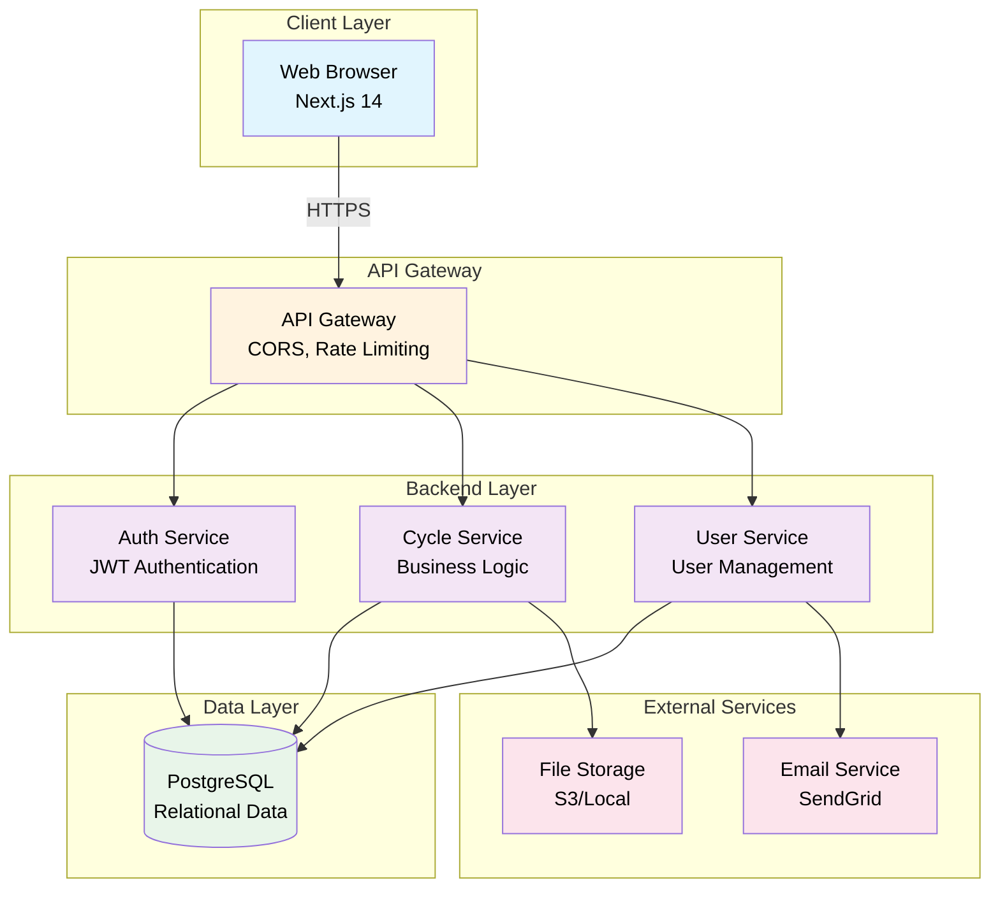

### 1.2 Technology Stack

| Layer | Technology | Purpose |
|-------|------------|---------|
| Frontend | Next.js 14, React 18, TypeScript | UI/UX, SSR, Static Generation |
| State Management | Zustand | Client-side state management |
| Styling | Tailwind CSS | Utility-first CSS framework |
| Backend | Spring Boot 3, Kotlin | REST API, Business Logic |
| Security | Spring Security, JWT | Authentication & Authorization |
| Database | PostgreSQL 16 | Relational data storage |
| ORM | Spring Data JPA | Database abstraction |
| API Documentation | SpringDoc OpenAPI | Swagger UI |
| Development | Docker Compose | Local database environment |

---

## 2. 백엔드 아키텍처

### 2.1 Layered Architecture

```mermaid
graph TB
    subgraph "Presentation Layer"
        Controller[Controllers<br/>@RestController]
        ExHandler[Exception Handler<br/>@ControllerAdvice]
    end

    subgraph "Security Layer"
        JwtFilter[JWT Filter<br/>Token Validation]
        SecConfig[Security Config<br/>Authorization Rules]
    end

    subgraph "Service Layer"
        AuthService[AuthService<br/>Login/Register]
        CycleService[CycleService<br/>CRUD Operations]
        StatsService[Statistics Service<br/>Calculations]
    end

    subgraph "Repository Layer"
        UserRepo[UserRepository<br/>JPA]
        CycleRepo[CycleRepository<br/>JPA]
    end

    subgraph "Domain Layer"
        User[User Entity]
        Cycle[Cycle Entity]
    end

    Controller --> JwtFilter
    JwtFilter --> SecConfig
    SecConfig --> AuthService
    SecConfig --> CycleService

    AuthService --> UserRepo
    CycleService --> CycleRepo
    CycleService --> StatsService

    UserRepo --> User
    CycleRepo --> Cycle

    User -.One-to-Many.-> Cycle

    style Controller fill:#bbdefb,color:#000
    style ExHandler fill:#bbdefb,color:#000
    style JwtFilter fill:#f8bbd0,color:#000
    style SecConfig fill:#f8bbd0,color:#000
    style AuthService fill:#c5e1a5,color:#000
    style CycleService fill:#c5e1a5,color:#000
    style StatsService fill:#c5e1a5,color:#000
    style UserRepo fill:#fff9c4,color:#000
    style CycleRepo fill:#fff9c4,color:#000
    style User fill:#ffccbc,color:#000
    style Cycle fill:#ffccbc,color:#000
```

### 2.2 Package Structure

```
com.periodtracker
├── PeriodTrackerApplication.kt          # Main Application
├── config/                               # Configuration
│   ├── JwtProperties.kt                 # JWT configuration
│   └── SecurityConfig.kt                # Spring Security setup
├── controller/                           # REST Controllers
│   ├── AuthController.kt                # Authentication endpoints
│   └── CycleController.kt               # Cycle CRUD endpoints
├── domain/                               # Domain Entities
│   ├── User.kt                          # User entity
│   ├── Cycle.kt                         # Cycle entity
│   └── FlowIntensity.kt                 # Enum for flow intensity
├── dto/                                  # Data Transfer Objects
│   ├── AuthDto.kt                       # Auth request/response
│   └── CycleDto.kt                      # Cycle request/response
├── repository/                           # Data Access
│   ├── UserRepository.kt                # User repository
│   └── CycleRepository.kt               # Cycle repository
├── service/                              # Business Logic
│   ├── AuthService.kt                   # Authentication service
│   └── CycleService.kt                  # Cycle service
└── security/                             # Security Components
    ├── JwtTokenProvider.kt              # JWT token handling
    ├── JwtAuthenticationFilter.kt       # JWT filter
    └── CustomUserDetailsService.kt      # User details service
```

### 2.3 Request Processing Flow

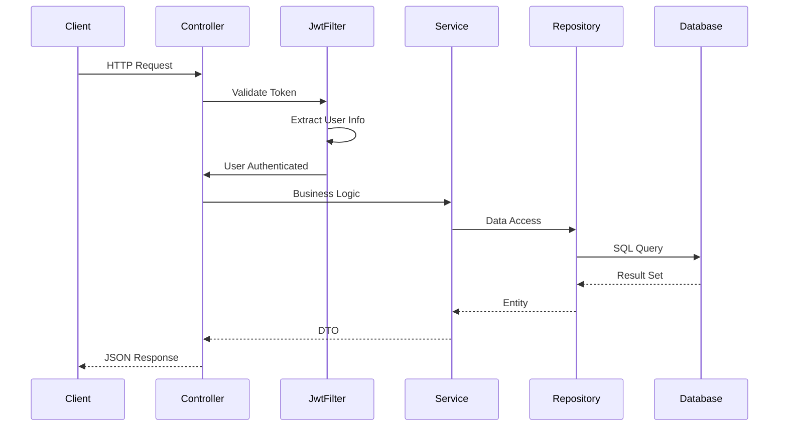

---

## 3. 프론트엔드 아키텍처

### 3.1 Component Architecture

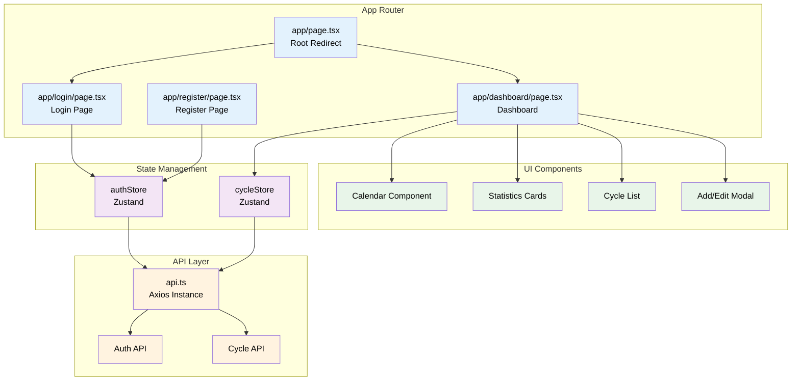

### 3.2 Directory Structure

```
frontend/src
├── app/                          # Next.js App Router
│   ├── globals.css              # Global styles
│   ├── layout.tsx               # Root layout
│   ├── page.tsx                 # Home page (redirect)
│   ├── login/
│   │   └── page.tsx            # Login page
│   ├── register/
│   │   └── page.tsx            # Register page
│   └── dashboard/
│       └── page.tsx            # Dashboard page
├── components/                   # Reusable components
│   ├── Calendar/               # Calendar component
│   ├── CycleCard/              # Cycle display card
│   ├── Modal/                  # Modal components
│   └── Stats/                  # Statistics cards
├── lib/                         # Utilities
│   └── api.ts                  # Axios configuration
├── store/                       # State management
│   ├── authStore.ts            # Auth state (Zustand)
│   └── cycleStore.ts           # Cycle state (Zustand)
└── types/                       # TypeScript types
    └── index.ts                # Type definitions
```

### 3.3 State Management Flow

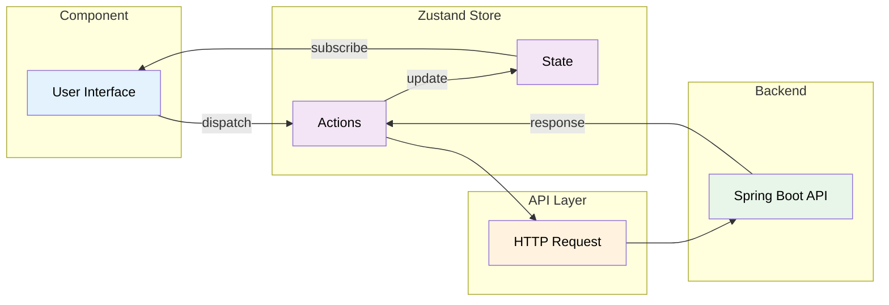

---

## 4. 데이터베이스 설계

### 4.1 ERD (Entity Relationship Diagram)

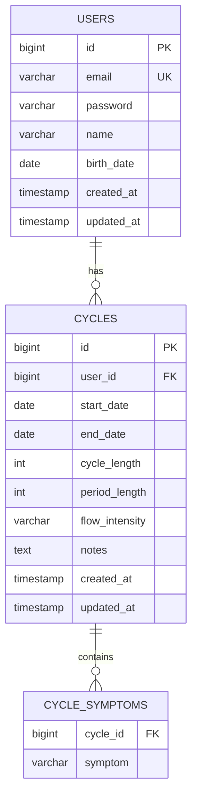

### 4.2 Table Specifications

#### users 테이블
```sql
CREATE TABLE users (
    id              BIGSERIAL PRIMARY KEY,
    email           VARCHAR(255) NOT NULL UNIQUE,
    password        VARCHAR(255) NOT NULL,
    name            VARCHAR(100) NOT NULL,
    birth_date      DATE,
    created_at      TIMESTAMP NOT NULL DEFAULT CURRENT_TIMESTAMP,
    updated_at      TIMESTAMP NOT NULL DEFAULT CURRENT_TIMESTAMP
);

CREATE INDEX idx_users_email ON users(email);
```

#### cycles 테이블
```sql
CREATE TABLE cycles (
    id              BIGSERIAL PRIMARY KEY,
    user_id         BIGINT NOT NULL REFERENCES users(id) ON DELETE CASCADE,
    start_date      DATE NOT NULL,
    end_date        DATE,
    cycle_length    INTEGER,
    period_length   INTEGER,
    flow_intensity  VARCHAR(20),
    notes           TEXT,
    created_at      TIMESTAMP NOT NULL DEFAULT CURRENT_TIMESTAMP,
    updated_at      TIMESTAMP NOT NULL DEFAULT CURRENT_TIMESTAMP,

    CONSTRAINT chk_end_date CHECK (end_date IS NULL OR end_date >= start_date)
);

CREATE INDEX idx_cycles_user_id ON cycles(user_id);
CREATE INDEX idx_cycles_start_date ON cycles(start_date);
CREATE INDEX idx_cycles_user_start_date ON cycles(user_id, start_date DESC);
```

#### cycle_symptoms 테이블
```sql
CREATE TABLE cycle_symptoms (
    cycle_id    BIGINT NOT NULL REFERENCES cycles(id) ON DELETE CASCADE,
    symptom     VARCHAR(100) NOT NULL,

    PRIMARY KEY (cycle_id, symptom)
);

CREATE INDEX idx_symptoms_cycle_id ON cycle_symptoms(cycle_id);
```

### 4.3 Data Integrity Rules

| Rule | Description |
|------|-------------|
| Referential Integrity | user_id FK with CASCADE delete |
| Date Validation | end_date >= start_date |
| Email Uniqueness | Unique constraint on email |
| Password Security | BCrypt hashed, minimum 8 characters |
| Cascading Deletes | Delete user → delete all cycles → delete all symptoms |

---

## 5. 인증 플로우

### 5.1 Registration Flow

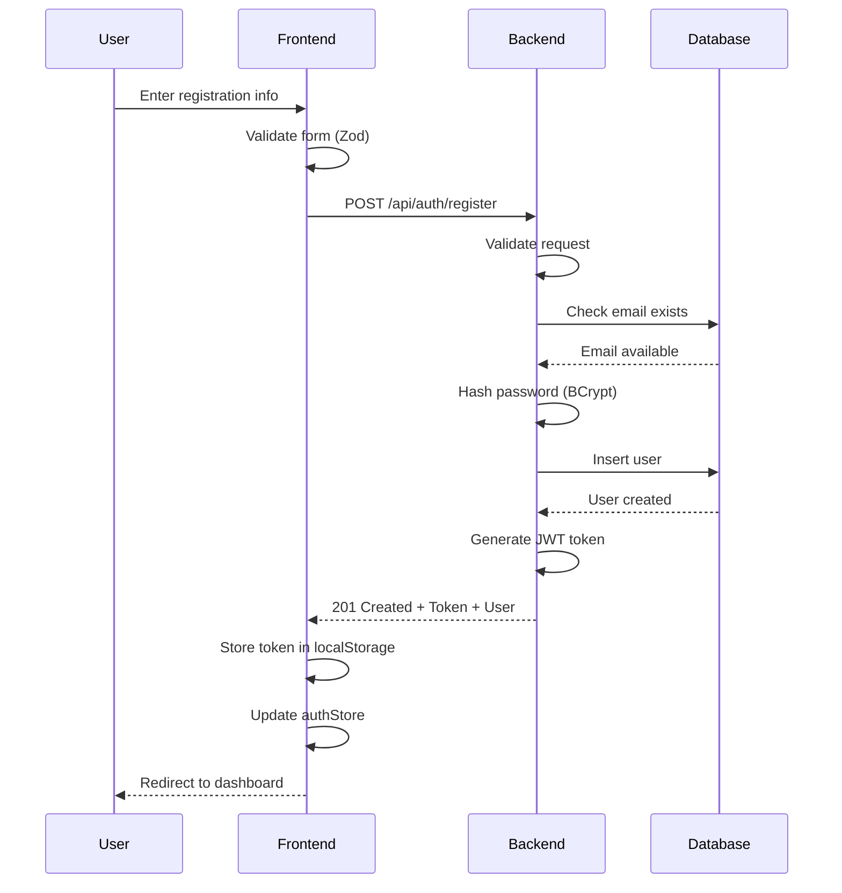

### 5.2 Login Flow

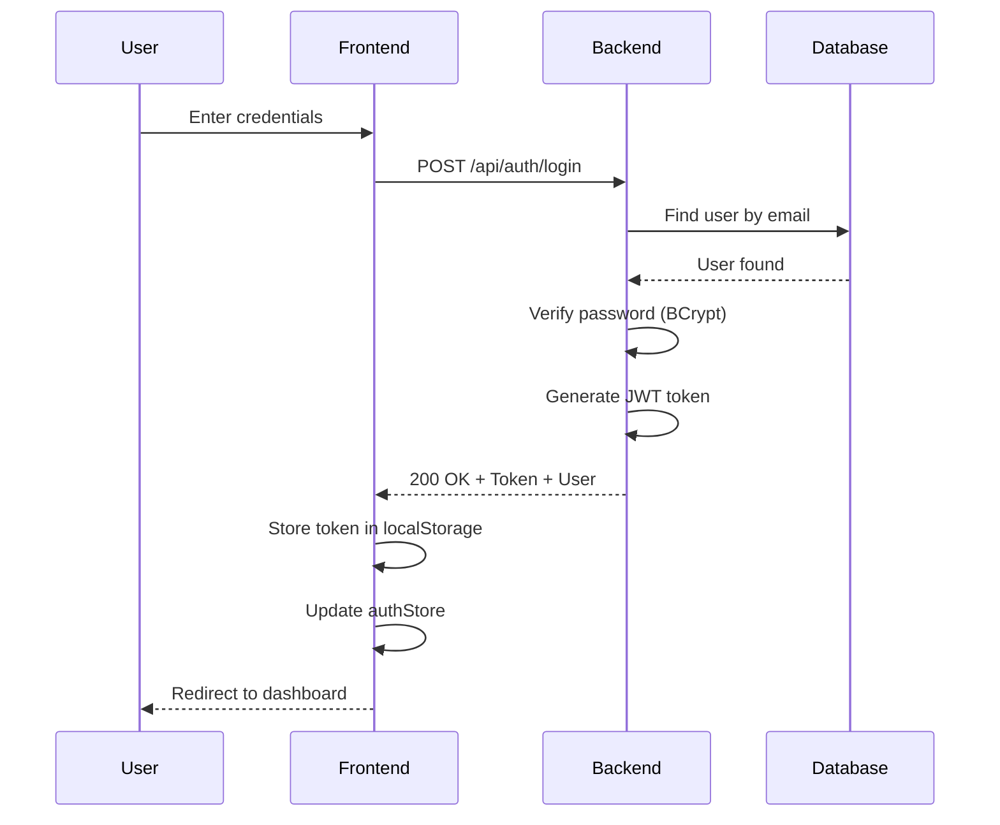

### 5.3 Authenticated Request Flow

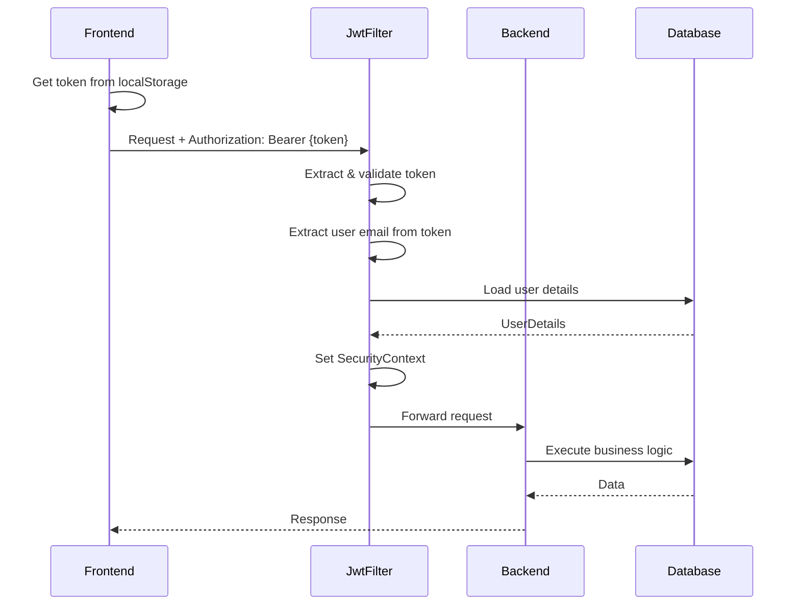

### 5.4 JWT Token Structure

```json
{
  "header": {
    "alg": "HS512",
    "typ": "JWT"
  },
  "payload": {
    "sub": "user@example.com",
    "iat": 1703145600,
    "exp": 1703232000
  },
  "signature": "HMACSHA512(...)"
}
```

**Token Specifications:**
- Algorithm: HS512
- Expiration: 24 hours
- Storage: localStorage (Frontend)
- Transmission: Authorization header (Bearer scheme)

---

## 6. API 통신

### 6.1 API Endpoints

#### Authentication Endpoints

| Method | Endpoint | Description | Auth Required |
|--------|----------|-------------|---------------|
| POST | `/api/auth/register` | 회원가입 | No |
| POST | `/api/auth/login` | 로그인 | No |

#### Cycle Management Endpoints

| Method | Endpoint | Description | Auth Required |
|--------|----------|-------------|---------------|
| GET | `/api/cycles` | 주기 목록 조회 | Yes |
| POST | `/api/cycles` | 주기 생성 | Yes |
| GET | `/api/cycles/{id}` | 주기 상세 조회 | Yes |
| PUT | `/api/cycles/{id}` | 주기 수정 | Yes |
| DELETE | `/api/cycles/{id}` | 주기 삭제 | Yes |
| GET | `/api/cycles/stats` | 통계 조회 | Yes |

### 6.2 Request/Response Examples

#### POST /api/auth/register

**Request:**
```json
{
  "email": "user@example.com",
  "password": "password123",
  "name": "홍길동",
  "birthDate": "1990-01-01"
}
```

**Response (201 Created):**
```json
{
  "token": "eyJhbGciOiJIUzUxMiJ9...",
  "type": "Bearer",
  "user": {
    "id": 1,
    "email": "user@example.com",
    "name": "홍길동",
    "birthDate": "1990-01-01"
  }
}
```

#### POST /api/cycles

**Request:**
```json
{
  "startDate": "2024-12-01",
  "endDate": "2024-12-05",
  "flowIntensity": "MEDIUM",
  "symptoms": ["복통", "피로", "두통"],
  "notes": "평소보다 심한 복통"
}
```

**Response (201 Created):**
```json
{
  "id": 1,
  "startDate": "2024-12-01",
  "endDate": "2024-12-05",
  "cycleLength": 28,
  "periodLength": 5,
  "flowIntensity": "MEDIUM",
  "symptoms": ["복통", "피로", "두통"],
  "notes": "평소보다 심한 복통"
}
```

#### GET /api/cycles/stats

**Response (200 OK):**
```json
{
  "averageCycleLength": 28.5,
  "averagePeriodLength": 5.2,
  "nextPredictedStartDate": "2024-12-28",
  "totalCycles": 10,
  "commonSymptoms": {
    "복통": 8,
    "피로": 6,
    "두통": 4,
    "기분 변화": 5
  }
}
```

### 6.3 Error Handling

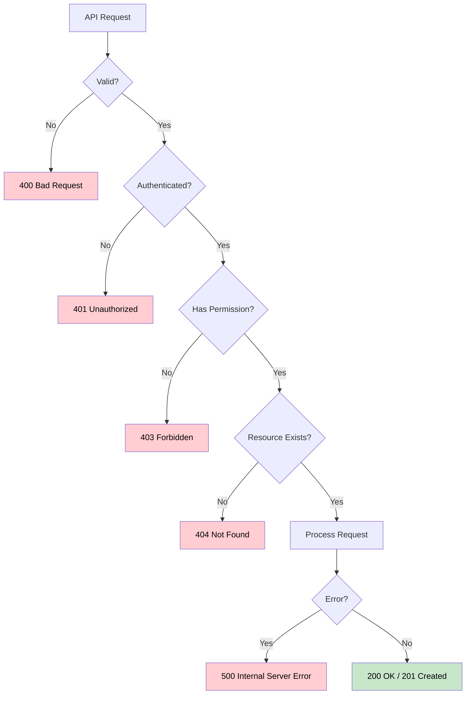

**Standard Error Response:**
```json
{
  "timestamp": "2024-12-21T10:30:00",
  "status": 400,
  "error": "Bad Request",
  "message": "시작일은 필수입니다",
  "path": "/api/cycles"
}
```

---

## 7. 배포 아키텍처

### 7.1 Development Environment

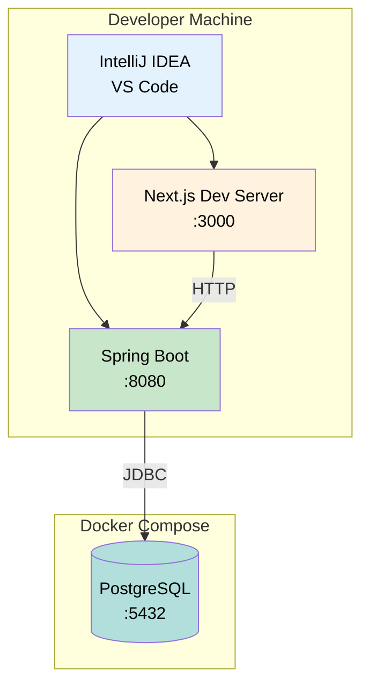

### 7.2 Production Environment (Future)

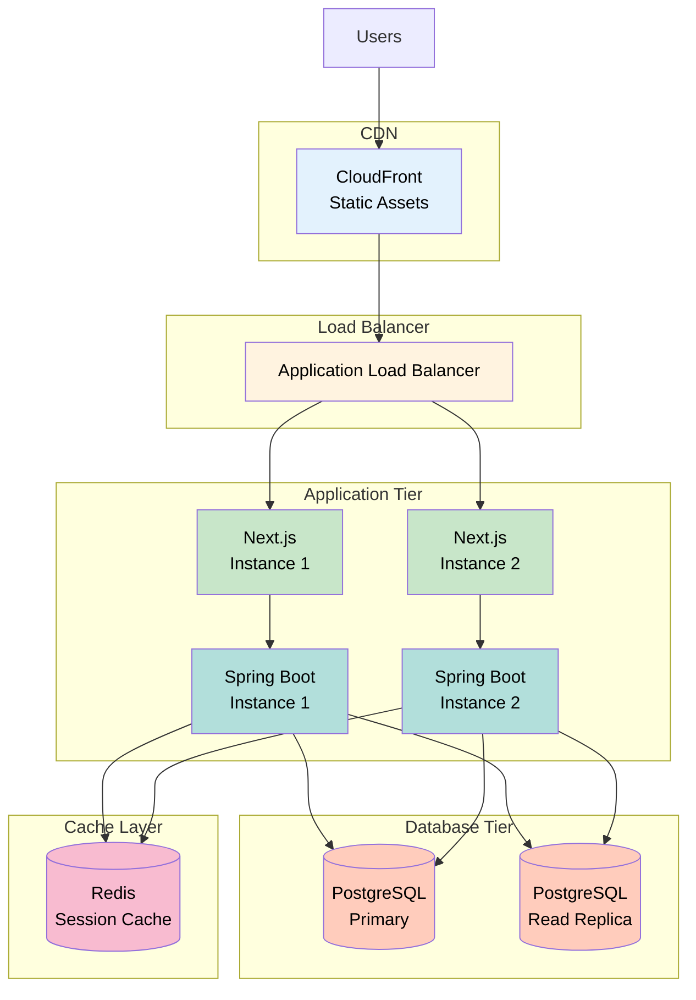

### 7.3 CI/CD Pipeline (Future)

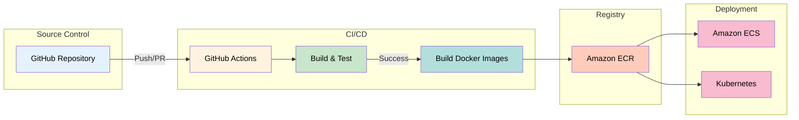

---

## 8. 보안 아키텍처

### 8.1 Security Layers

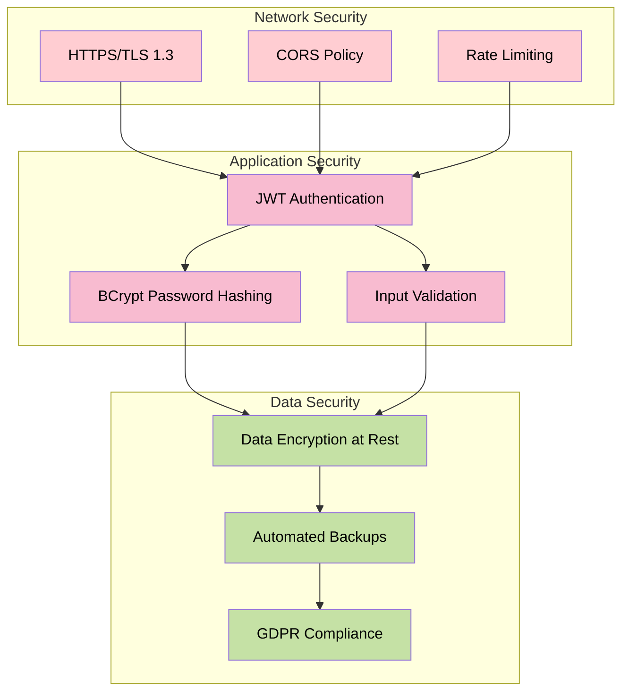

### 8.2 Security Checklist

| Category | Implementation | Status |
|----------|----------------|--------|
| **Transport Security** |
| HTTPS enforcement | Required for production | ⏳ Pending |
| TLS 1.3 | Modern encryption | ⏳ Pending |
| **Authentication** |
| JWT tokens | HS512 algorithm | ✅ Implemented |
| Token expiration | 24 hours | ✅ Implemented |
| Password hashing | BCrypt (strength 10) | ✅ Implemented |
| **Authorization** |
| Role-based access | User roles | ⏳ Pending |
| Resource ownership | User can only access own data | ✅ Implemented |
| **Input Validation** |
| Frontend validation | React Hook Form + Zod | ✅ Implemented |
| Backend validation | Bean Validation | ✅ Implemented |
| SQL injection prevention | JPA Parameterized queries | ✅ Implemented |
| XSS prevention | React auto-escaping | ✅ Implemented |
| **Data Protection** |
| CORS configuration | Whitelist origins | ✅ Implemented |
| Rate limiting | Prevent abuse | ⏳ Pending |
| Data encryption | At rest | ⏳ Pending |
| Automated backups | Daily | ⏳ Pending |

---

## 9. 성능 최적화

### 9.1 Database Optimization

```sql
-- 자주 사용되는 쿼리 최적화를 위한 인덱스
CREATE INDEX idx_cycles_user_start_date ON cycles(user_id, start_date DESC);
CREATE INDEX idx_users_email ON users(email);

-- 통계 쿼리 최적화
CREATE INDEX idx_cycles_created_at ON cycles(created_at DESC);
```

### 9.2 Caching Strategy (Future)

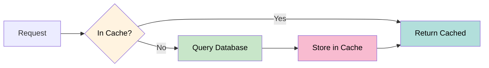

**Caching Targets:**
- User session data (Redis)
- Frequently accessed cycle data
- Calculated statistics
- API response caching (short TTL)

### 9.3 Frontend Performance

| Technique | Implementation |
|-----------|----------------|
| Code Splitting | Next.js automatic code splitting |
| Image Optimization | Next.js Image component |
| Static Generation | ISR for public pages |
| Client-side Caching | Zustand persist middleware |
| Bundle Analysis | webpack-bundle-analyzer |

---

## 10. 모니터링 및 로깅

### 10.1 Logging Architecture (Future)

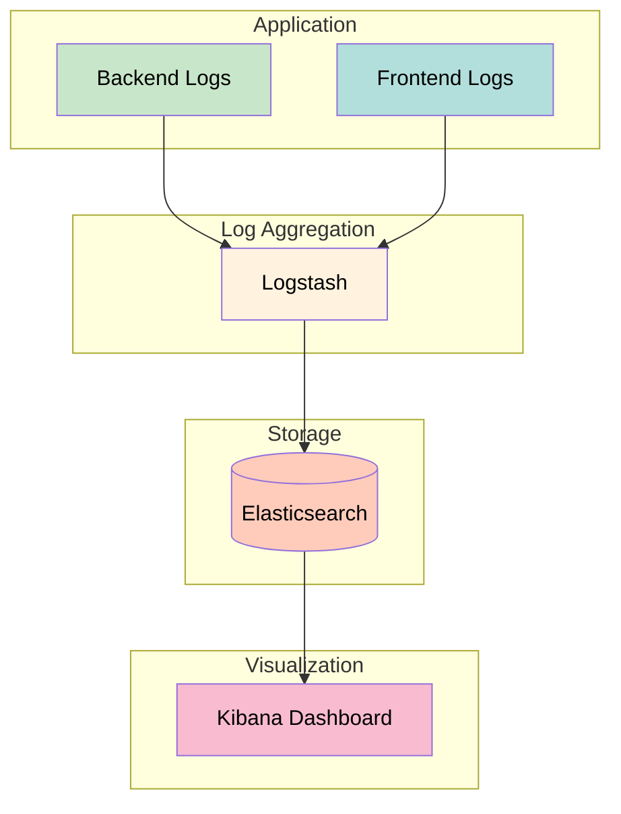

### 10.2 Metrics to Monitor

| Metric | Tool | Alert Threshold |
|--------|------|-----------------|
| API Response Time | Application logs | > 500ms |
| Error Rate | Error tracking | > 1% |
| Database Connections | PostgreSQL stats | > 80% pool |
| Memory Usage | System monitoring | > 85% |
| CPU Usage | System monitoring | > 80% |
| Active Users | Analytics | - |

---

## 11. 확장성 고려사항

### 11.1 Horizontal Scaling

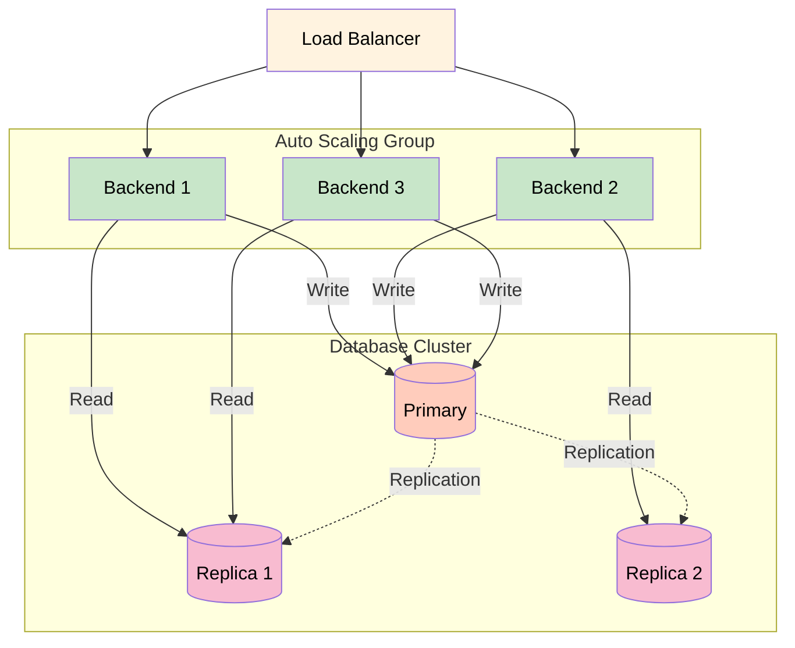

### 11.2 Future Enhancements

1. **Microservices Architecture**
   - Separate Auth Service
   - Separate Cycle Service
   - Separate Notification Service

2. **Event-Driven Architecture**
   - Message Queue (RabbitMQ/Kafka)
   - Async processing for notifications
   - Event sourcing for audit trail

3. **Global Distribution**
   - Multi-region deployment
   - CDN for static assets
   - Geographic data residency compliance

---

## 문서 정보

- **버전**: 1.0
- **작성일**: 2024-12-21
- **최종 수정일**: 2024-12-21
- **담당자**: Period Tracker 개발팀
