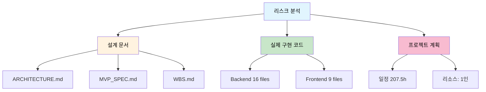
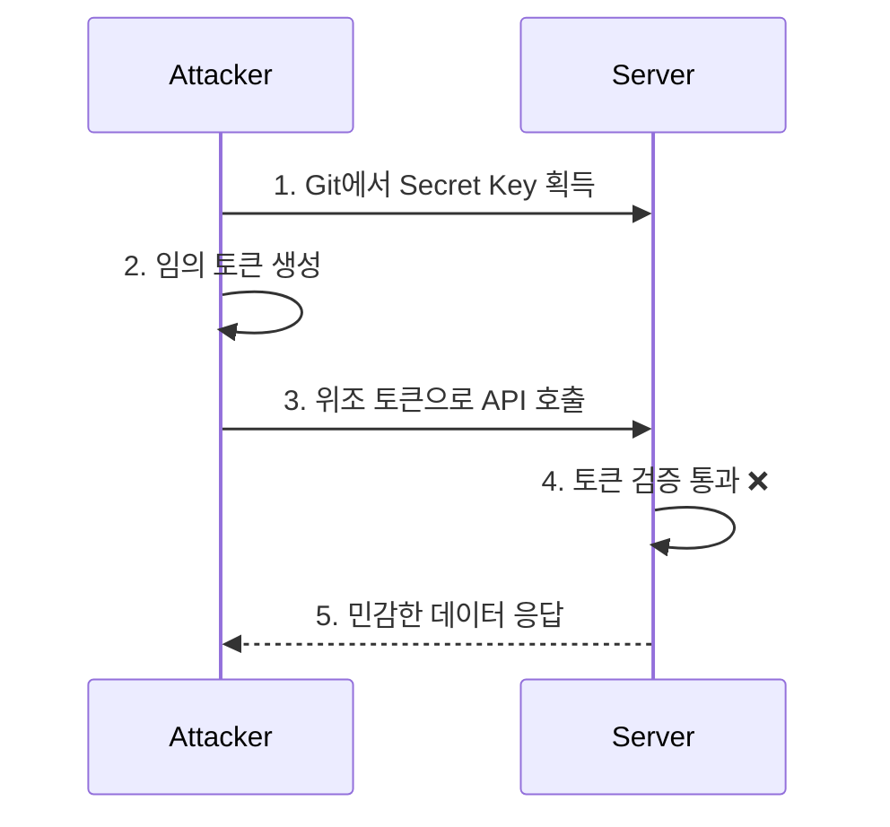
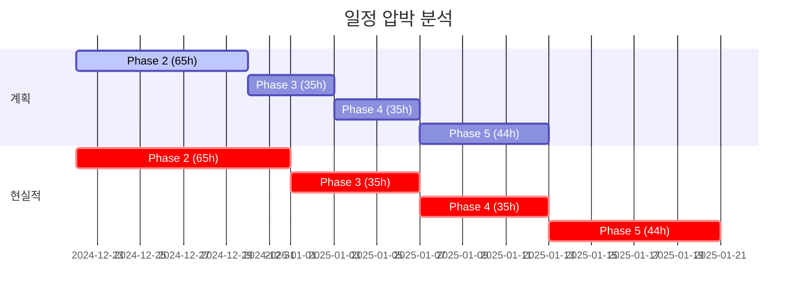
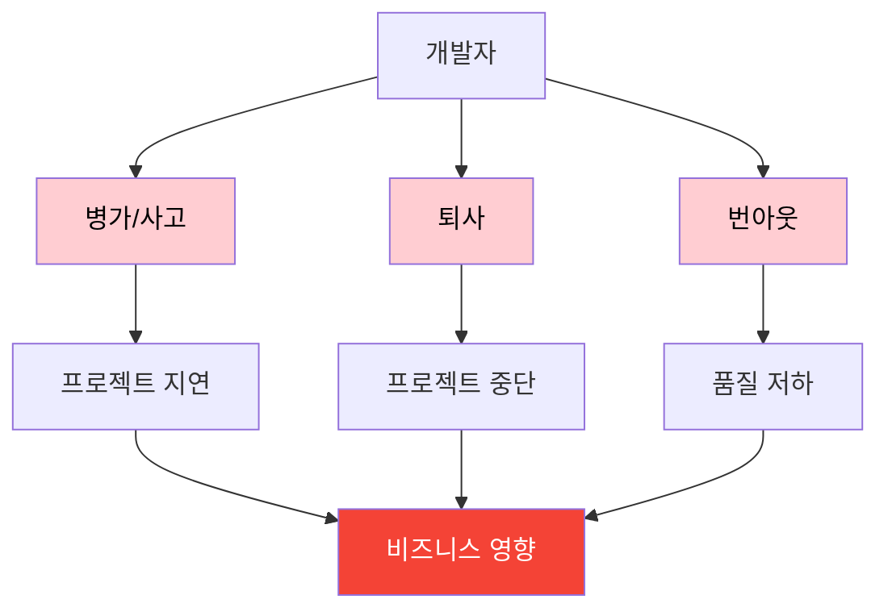
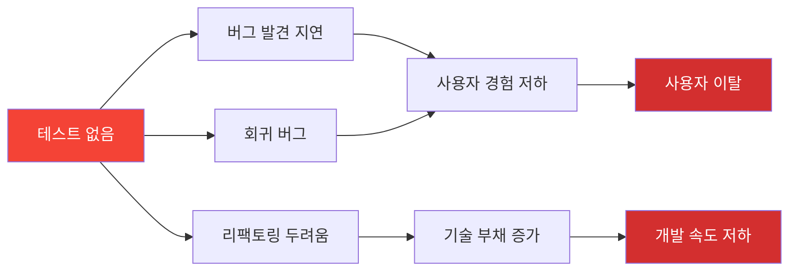
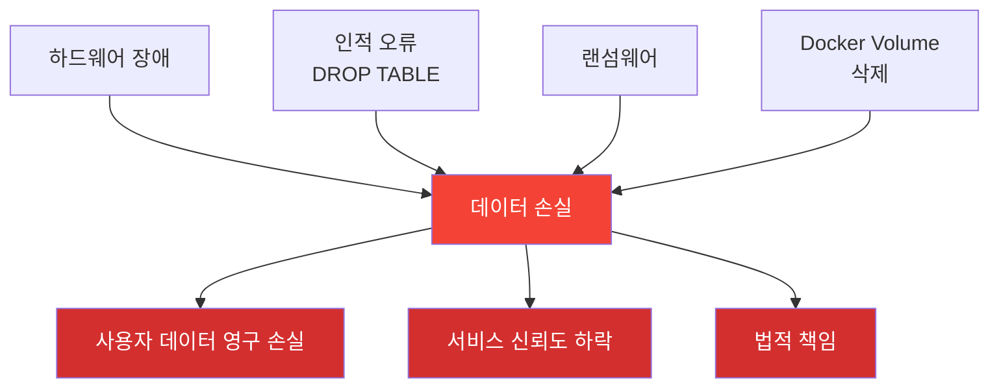
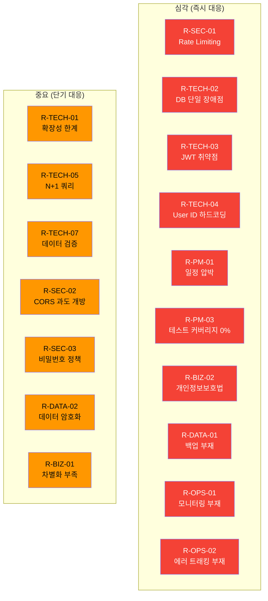
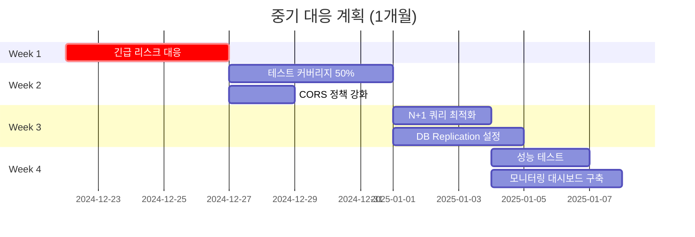

# Period Tracker - 리스크 분석 보고서

> 설계 결과물 분석을 통한 종합적인 리스크 평가 및 대응 전략

**작성일**: 2024-12-21
**분석 기준**: 설계 문서(ARCHITECTURE.md, MVP_SPEC.md, WBS.md) 및 실제 구현 코드

---

## 목차

1. [Executive Summary](#1-executive-summary)
2. [분석 방법론](#2-분석-방법론)
3. [기술적 리스크](#3-기술적-리스크)
4. [보안 리스크](#4-보안-리스크)
5. [프로젝트 관리 리스크](#5-프로젝트-관리-리스크)
6. [비즈니스 리스크](#6-비즈니스-리스크)
7. [데이터 및 개인정보 리스크](#7-데이터-및-개인정보-리스크)
8. [운영 리스크](#8-운영-리스크)
9. [리스크 우선순위 매트릭스](#9-리스크-우선순위-매트릭스)
10. [대응 계획 로드맵](#10-대응-계획-로드맵)
11. [모니터링 지표](#11-모니터링-지표)

---

## 1. Executive Summary

### 1.1 종합 평가

| 평가 항목 | 점수 | 상태 | 코멘트 |
|----------|------|------|--------|
| **전체 리스크 수준** | 중간 | ⚠️ 주의 | 적절한 대응 전략 필요 |
| **기술적 완성도** | 60% | 🔄 진행 중 | 핵심 기능 부분 완성 |
| **보안 준비도** | 50% | ⚠️ 보완 필요 | 추가 보안 조치 필수 |
| **일정 위험도** | 높음 | 🔴 주의 | 버퍼 시간 부족 |
| **확장성** | 낮음 | ⚠️ 설계 개선 필요 | 모놀리식 구조 |

### 1.2 주요 발견사항

**🔴 심각한 리스크 (즉시 대응 필요)**
1. JWT Secret Key가 하드코딩되어 있음
2. Rate Limiting 미구현 (DDoS 취약)
3. 에러 처리 및 로깅 체계 부재
4. 데이터 백업 시스템 없음

**🟡 중요 리스크 (단기 대응 필요)**
1. 사용자 ID 하드코딩 (실제 인증 사용자 ID 미사용)
2. API 성능 테스트 미실시
3. 프론트엔드 에러 바운더리 없음
4. HTTPS 미적용 (개발 환경만 HTTP)

**🟢 일반 리스크 (중장기 대응)**
1. 코드 테스트 커버리지 0%
2. CI/CD 파이프라인 없음
3. 모니터링 시스템 없음

---

## 2. 분석 방법론

### 2.1 분석 대상



### 2.2 평가 기준

| 기준 | 설명 | 가중치 |
|------|------|--------|
| **발생 가능성** | 리스크가 실제로 발생할 확률 (1-5) | 40% |
| **영향도** | 발생 시 프로젝트에 미치는 영향 (1-5) | 40% |
| **탐지 난이도** | 문제를 조기에 발견하기 어려운 정도 (1-5) | 20% |

**리스크 점수 = (발생 가능성 × 0.4) + (영향도 × 0.4) + (탐지 난이도 × 0.2)**

---

## 3. 기술적 리스크

### 3.1 아키텍처 리스크

#### R-TECH-01: 모놀리식 아키텍처의 확장성 한계 🟡

**현재 상황:**
- 백엔드가 단일 Spring Boot 애플리케이션
- 모든 서비스(Auth, Cycle, User)가 하나의 프로세스에 통합
- 수평적 확장 시 전체 애플리케이션 복제 필요

**리스크 평가:**
| 항목 | 점수 | 근거 |
|------|------|------|
| 발생 가능성 | 4/5 | 사용자 증가 시 불가피 |
| 영향도 | 3/5 | 성능 저하 및 비용 증가 |
| 탐지 난이도 | 2/5 | 성능 모니터링으로 조기 감지 가능 |
| **총점** | **3.2** | 중간 위험 |

**영향:**
- 특정 서비스만 확장 불가 (비효율적 리소스 사용)
- 장애 격리 불가능 (전체 서비스 다운 위험)
- 배포 시 전체 서비스 재시작 필요

**대응 전략:**


**즉시 조치:**
- [ ] Service Layer를 명확히 분리 (이미 구현됨 ✅)
- [ ] API 버전 관리 체계 수립
- [ ] 모니터링을 통한 병목 지점 파악

**중기 조치 (3-6개월):**
- [ ] 도메인별 패키지 분리 강화
- [ ] Event-Driven Architecture 도입 검토
- [ ] 캐싱 레이어 추가 (Redis)

---

#### R-TECH-02: 데이터베이스 단일 장애점 🔴

**현재 상황:**
```yaml
# docker-compose.yml - 단일 PostgreSQL 인스턴스
postgres:
  image: postgres:16-alpine
  # 복제 없음, 백업 없음
```

**리스크 평가:**
| 항목 | 점수 |
|------|------|
| 발생 가능성 | 3/5 |
| 영향도 | 5/5 |
| 탐지 난이도 | 4/5 |
| **총점** | **3.8** | 🔴 **높은 위험** |

**영향:**
- DB 장애 = 전체 서비스 중단
- 데이터 손실 위험
- 복구 시간 예측 불가

**대응 전략:**

**즉시 조치 (1주 이내):**
```bash
# 1. 자동 백업 스크립트 작성
#!/bin/bash
# backup.sh
docker exec period-tracker-db pg_dump \
  -U postgres period_tracker > \
  backup_$(date +%Y%m%d_%H%M%S).sql

# 2. Cron 설정 (매일 자동 백업)
0 2 * * * /path/to/backup.sh
```

**단기 조치 (1개월):**
- [ ] PostgreSQL Streaming Replication 구성
- [ ] Read Replica 추가
- [ ] 백업 자동화 및 S3 업로드

**중기 조치:**
- [ ] Database Connection Pool 최적화
- [ ] Query 성능 모니터링
- [ ] Failover 자동화

---

#### R-TECH-03: JWT Token 관리 취약점 🔴

**현재 상황:**
```kotlin
// application.yml
jwt:
  secret: your-secret-key-change-this-in-production-min-256-bits-long
  expiration: 86400000  # 24시간
```

**발견된 문제:**
1. ❌ Secret Key가 코드에 하드코딩
2. ❌ Token Refresh 메커니즘 없음
3. ❌ Token Revocation 불가능
4. ❌ 사용자 로그아웃 시 Token이 여전히 유효

**리스크 평가:**
| 항목 | 점수 |
|------|------|
| 발생 가능성 | 5/5 |
| 영향도 | 5/5 |
| 탐지 난이도 | 3/5 |
| **총점** | **4.4** | 🔴 **심각한 위험** |

**공격 시나리오:**


**대응 전략:**

**즉시 조치 (오늘):**
```kotlin
// 1. 환경 변수로 Secret Key 분리
@Configuration
@ConfigurationProperties(prefix = "jwt")
data class JwtProperties(
    val secret: String = System.getenv("JWT_SECRET")
        ?: throw IllegalStateException("JWT_SECRET not set"),
    val expiration: Long
)

// 2. .gitignore에 환경 변수 파일 추가
// .env
// application-local.yml
```

**단기 조치 (1주):**
```kotlin
// Token Blacklist 구현
@Service
class TokenBlacklistService(
    private val redisTemplate: RedisTemplate<String, String>
) {
    fun blacklistToken(token: String, expirationTime: Long) {
        redisTemplate.opsForValue()
            .set("blacklist:$token", "true", expirationTime, TimeUnit.MILLISECONDS)
    }

    fun isBlacklisted(token: String): Boolean {
        return redisTemplate.hasKey("blacklist:$token")
    }
}
```

**중기 조치:**
- [ ] Refresh Token 구현
- [ ] Token Rotation 정책
- [ ] Multi-device 세션 관리

---

#### R-TECH-04: 사용자 ID 하드코딩 문제 🔴

**현재 상황:**
```kotlin
// CycleController.kt - 실제 코드
@PostMapping
fun createCycle(
    @AuthenticationPrincipal userDetails: UserDetails,
    @Valid @RequestBody request: CreateCycleRequest
): ResponseEntity<CycleResponse> {
    val userId = 1L // ❌ 하드코딩!
    val response = cycleService.createCycle(userId, request)
    return ResponseEntity.status(HttpStatus.CREATED).body(response)
}
```

**문제점:**
- 모든 사용자가 동일한 ID(1)로 데이터 저장
- 데이터 혼재 및 권한 문제
- 프로덕션 배포 불가능

**리스크 평가:**
| 항목 | 점수 |
|------|------|
| 발생 가능성 | 5/5 |
| 영향도 | 5/5 |
| 탐지 난이도 | 1/5 |
| **총점** | **4.2** | 🔴 **심각한 위험** |

**대응 전략:**

**즉시 수정 (오늘):**
```kotlin
// 올바른 구현
@PostMapping
fun createCycle(
    @AuthenticationPrincipal userDetails: UserDetails,
    @Valid @RequestBody request: CreateCycleRequest
): ResponseEntity<CycleResponse> {
    // UserDetails에서 실제 사용자 ID 추출
    val user = userRepository.findByEmail(userDetails.username)
        .orElseThrow { IllegalArgumentException("User not found") }

    val response = cycleService.createCycle(user.id!!, request)
    return ResponseEntity.status(HttpStatus.CREATED).body(response)
}

// 또는 커스텀 Principal 사용
data class CustomUserPrincipal(
    val userId: Long,
    val email: String,
    private val authorities: Collection<GrantedAuthority>
) : UserDetails {
    // UserDetails 메서드 구현...
}
```

---

### 3.2 성능 리스크

#### R-TECH-05: N+1 쿼리 문제 잠재성 🟡

**현재 설계:**
```kotlin
// Cycle.kt
@Entity
data class Cycle(
    @ManyToOne(fetch = FetchType.LAZY)
    @JoinColumn(name = "user_id")
    val user: User,
    // ...
)

// User.kt
@Entity
data class User(
    @OneToMany(mappedBy = "user", cascade = [CascadeType.ALL])
    val cycles: MutableList<Cycle> = mutableListOf()
)
```

**문제:**
- Lazy Loading 사용 시 N+1 쿼리 발생 가능
- 주기 목록 조회 시 각 주기마다 User 조회

**예상 쿼리:**
```sql
-- 1개 쿼리: 주기 목록
SELECT * FROM cycles WHERE user_id = 1;

-- N개 쿼리: 각 주기의 사용자 정보 (불필요)
SELECT * FROM users WHERE id = 1;  -- 주기 1
SELECT * FROM users WHERE id = 1;  -- 주기 2
SELECT * FROM users WHERE id = 1;  -- 주기 3
-- ... (주기 개수만큼 반복)
```

**리스크 평가:**
| 항목 | 점수 |
|------|------|
| 발생 가능성 | 4/5 |
| 영향도 | 3/5 |
| 탐지 난이도 | 3/5 |
| **총점** | **3.4** | 중간 위험 |

**대응 전략:**
```kotlin
// 1. Fetch Join 사용
interface CycleRepository : JpaRepository<Cycle, Long> {
    @Query("SELECT c FROM Cycle c JOIN FETCH c.user WHERE c.user.id = :userId")
    fun findByUserIdWithUser(@Param("userId") userId: Long): List<Cycle>
}

// 2. DTO 프로젝션
@Query("SELECT new com.periodtracker.dto.CycleResponse(c.id, c.startDate, ...) " +
       "FROM Cycle c WHERE c.user.id = :userId")
fun findCycleDtosByUserId(@Param("userId") userId: Long): List<CycleResponse>

// 3. Batch Fetch Size 설정
// application.yml
spring:
  jpa:
    properties:
      hibernate:
        default_batch_fetch_size: 100
```

---

#### R-TECH-06: API 응답 시간 미측정 🟡

**현재 상황:**
- 성능 테스트 미실시
- API 응답 시간 목표: < 200ms (WBS.md)
- 실제 측정값: 없음

**리스크 평가:**
| 항목 | 점수 |
|------|------|
| 발생 가능성 | 4/5 |
| 영향도 | 3/5 |
| 탐지 난이도 | 2/5 |
| **총점** | **3.2** | 중간 위험 |

**대응 전략:**

**즉시 조치:**
```kotlin
// Spring Boot Actuator 추가
// build.gradle.kts
dependencies {
    implementation("org.springframework.boot:spring-boot-starter-actuator")
    implementation("io.micrometer:micrometer-registry-prometheus")
}

// application.yml
management:
  endpoints:
    web:
      exposure:
        include: health,metrics,prometheus
  metrics:
    export:
      prometheus:
        enabled: true
```

**성능 테스트 시나리오:**
```bash
# Apache Bench
ab -n 1000 -c 10 http://localhost:8080/api/cycles

# 또는 K6
k6 run performance-test.js
```

---

### 3.3 데이터 정합성 리스크

#### R-TECH-07: 주기 데이터 검증 부족 🟡

**현재 검증:**
```kotlin
// CreateCycleRequest
data class CreateCycleRequest(
    @field:NotNull(message = "시작일은 필수입니다")
    val startDate: LocalDate,
    val endDate: LocalDate? = null,
    // ...
)

// Cycle 엔티티
@Entity
@Table(name = "cycles")
data class Cycle(
    // CHECK 제약조건 없음
)
```

**부족한 검증:**
1. ❌ 시작일이 미래 날짜인지 검증 없음
2. ❌ 종료일이 시작일보다 이전인지 검증 없음
3. ❌ 주기 길이 범위 검증 없음 (정상: 21-35일)
4. ❌ 월경 기간 검증 없음 (정상: 3-7일)
5. ❌ 중복 주기 검증 없음

**문제 시나리오:**
```json
// 잘못된 데이터 삽입 가능
{
  "startDate": "2030-01-01",  // 미래 날짜
  "endDate": "2025-01-01",     // 시작일보다 이전
  "periodLength": -5           // 음수
}
```

**리스크 평가:**
| 항목 | 점수 |
|------|------|
| 발생 가능성 | 4/5 |
| 영향도 | 3/5 |
| 탐지 난이도 | 2/5 |
| **총점** | **3.2** | 중간 위험 |

**대응 전략:**

**비즈니스 로직 검증:**
```kotlin
@Service
class CycleService(
    private val cycleRepository: CycleRepository,
    private val userRepository: UserRepository
) {
    @Transactional
    fun createCycle(userId: Long, request: CreateCycleRequest): CycleResponse {
        // 1. 날짜 유효성 검증
        validateDates(request.startDate, request.endDate)

        // 2. 중복 주기 검증
        validateDuplicateCycle(userId, request.startDate)

        // 3. 주기 범위 검증
        validateCycleRange(request)

        // ... 저장 로직
    }

    private fun validateDates(startDate: LocalDate, endDate: LocalDate?) {
        require(!startDate.isAfter(LocalDate.now())) {
            "시작일은 오늘 이전이어야 합니다"
        }

        if (endDate != null) {
            require(!endDate.isBefore(startDate)) {
                "종료일은 시작일 이후여야 합니다"
            }

            val periodLength = ChronoUnit.DAYS.between(startDate, endDate).toInt() + 1
            require(periodLength in 1..14) {
                "월경 기간은 1-14일 사이여야 합니다"
            }
        }
    }

    private fun validateDuplicateCycle(userId: Long, startDate: LocalDate) {
        val existingCycle = cycleRepository
            .findByUserIdAndStartDate(userId, startDate)

        require(existingCycle.isEmpty) {
            "해당 날짜의 주기가 이미 존재합니다"
        }
    }
}
```

**데이터베이스 제약조건:**
```sql
-- 테이블 변경
ALTER TABLE cycles
ADD CONSTRAINT chk_end_date
CHECK (end_date IS NULL OR end_date >= start_date);

ALTER TABLE cycles
ADD CONSTRAINT chk_start_date_not_future
CHECK (start_date <= CURRENT_DATE);

ALTER TABLE cycles
ADD CONSTRAINT chk_period_length
CHECK (period_length IS NULL OR (period_length >= 1 AND period_length <= 14));

ALTER TABLE cycles
ADD CONSTRAINT chk_cycle_length
CHECK (cycle_length IS NULL OR (cycle_length >= 15 AND cycle_length <= 45));
```

---

## 4. 보안 리스크

### 4.1 인증/인가 리스크

#### R-SEC-01: Rate Limiting 미구현 🔴

**현재 상황:**
```kotlin
// SecurityConfig.kt - Rate Limiting 없음
@Bean
fun securityFilterChain(http: HttpSecurity): SecurityFilterChain {
    http
        .authorizeHttpRequests { auth ->
            auth.requestMatchers("/api/auth/**").permitAll()
            // Rate Limiting 없음
        }
    // ...
}
```

**공격 시나리오:**
```bash
# Brute Force Attack
for i in {1..10000}; do
  curl -X POST http://localhost:8080/api/auth/login \
    -H "Content-Type: application/json" \
    -d '{"email":"victim@example.com","password":"guess'$i'"}'
done
```

**리스크 평가:**
| 항목 | 점수 |
|------|------|
| 발생 가능성 | 5/5 |
| 영향도 | 4/5 |
| 탐지 난이도 | 2/5 |
| **총점** | **4.0** | 🔴 **높은 위험** |

**영향:**
- 무차별 대입 공격 (Brute Force)
- 서비스 거부 공격 (DDoS)
- 자원 고갈

**대응 전략:**

**즉시 조치 (Bucket4j 사용):**
```kotlin
// build.gradle.kts
dependencies {
    implementation("com.bucket4j:bucket4j-core:8.7.0")
    implementation("com.github.vladimir-bukhtoyarov:bucket4j-redis:8.7.0")
}

// RateLimitingFilter.kt
@Component
class RateLimitingFilter : OncePerRequestFilter() {

    private val buckets = ConcurrentHashMap<String, Bucket>()

    override fun doFilterInternal(
        request: HttpServletRequest,
        response: HttpServletResponse,
        filterChain: FilterChain
    ) {
        val clientId = getClientId(request)
        val bucket = getBucket(clientId)

        if (bucket.tryConsume(1)) {
            filterChain.doFilter(request, response)
        } else {
            response.status = HttpStatus.TOO_MANY_REQUESTS.value()
            response.writer.write("""
                {"error": "Too many requests. Please try again later."}
            """.trimIndent())
        }
    }

    private fun getBucket(clientId: String): Bucket {
        return buckets.computeIfAbsent(clientId) {
            // 분당 60개 요청 허용
            Bucket.builder()
                .addLimit(Bandwidth.simple(60, Duration.ofMinutes(1)))
                .build()
        }
    }

    private fun getClientId(request: HttpServletRequest): String {
        // IP 기반 또는 User ID 기반
        return request.remoteAddr
    }
}
```

**엔드포인트별 제한:**
```kotlin
// 로그인: 분당 5회
// 회원가입: 시간당 3회
// API 조회: 분당 100회
// API 생성: 분당 30회
```

---

#### R-SEC-02: CORS 설정 과도하게 개방 🟡

**현재 상황:**
```kotlin
// SecurityConfig.kt
@Bean
fun corsConfigurationSource(): CorsConfigurationSource {
    val configuration = CorsConfiguration()
    configuration.allowedOrigins = listOf(
        "http://localhost:3000",
        "http://localhost:3001"
    )
    configuration.allowedMethods = listOf("GET", "POST", "PUT", "DELETE", "PATCH", "OPTIONS")
    configuration.allowedHeaders = listOf("*")  // ❌ 모든 헤더 허용
    configuration.allowCredentials = true
    // ...
}
```

**문제점:**
- `allowedHeaders = listOf("*")` - 모든 헤더 허용
- 프로덕션 환경에서 localhost 허용 가능성

**리스크 평가:**
| 항목 | 점수 |
|------|------|
| 발생 가능성 | 3/5 |
| 영향도 | 3/5 |
| 탐지 난이도 | 2/5 |
| **총점** | **2.8** | 중간 위험 |

**대응 전략:**
```kotlin
@Bean
fun corsConfigurationSource(): CorsConfigurationSource {
    val configuration = CorsConfiguration()

    // 환경별 Origin 설정
    val allowedOrigins = when (activeProfile) {
        "production" -> listOf("https://periodtracker.com")
        "staging" -> listOf("https://staging.periodtracker.com")
        else -> listOf("http://localhost:3000")
    }

    configuration.allowedOrigins = allowedOrigins
    configuration.allowedMethods = listOf("GET", "POST", "PUT", "DELETE")

    // 특정 헤더만 허용
    configuration.allowedHeaders = listOf(
        "Authorization",
        "Content-Type",
        "X-Requested-With"
    )

    configuration.allowCredentials = true
    configuration.maxAge = 3600 // 1시간

    // ...
}
```

---

#### R-SEC-03: 비밀번호 정책 미흡 🟡

**현재 상황:**
```kotlin
// RegisterRequest
data class RegisterRequest(
    @field:Size(min = 8, message = "비밀번호는 최소 8자 이상이어야 합니다")
    val password: String,
    // ...
)
```

**문제점:**
- 길이만 검증 (8자 이상)
- 복잡도 요구사항 없음 (대문자, 숫자, 특수문자)
- 흔한 비밀번호 차단 없음

**허용되는 약한 비밀번호:**
```
"12345678"  ✅ 통과 (8자)
"aaaaaaaa"  ✅ 통과 (8자)
"password"  ✅ 통과 (8자)
```

**리스크 평가:**
| 항목 | 점수 |
|------|------|
| 발생 가능성 | 4/5 |
| 영향도 | 4/5 |
| 탐지 난이도 | 1/5 |
| **총점** | **3.4** | 중간 위험 |

**대응 전략:**
```kotlin
// Custom Validator
@Target(AnnotationTarget.FIELD)
@Retention(AnnotationRetention.RUNTIME)
@Constraint(validatedBy = [StrongPasswordValidator::class])
annotation class StrongPassword(
    val message: String = "비밀번호는 8자 이상이며, 대문자, 소문자, 숫자, 특수문자를 포함해야 합니다",
    val groups: Array<KClass<*>> = [],
    val payload: Array<KClass<out Payload>> = []
)

class StrongPasswordValidator : ConstraintValidator<StrongPassword, String> {

    private val passwordPattern = Regex(
        "^(?=.*[a-z])(?=.*[A-Z])(?=.*\\d)(?=.*[@\$!%*?&])[A-Za-z\\d@\$!%*?&]{8,}\$"
    )

    private val commonPasswords = setOf(
        "12345678", "password", "qwerty123", "admin123", "letmein"
    )

    override fun isValid(value: String?, context: ConstraintValidatorContext): Boolean {
        if (value == null) return false

        // 1. 패턴 검증
        if (!passwordPattern.matches(value)) {
            return false
        }

        // 2. 흔한 비밀번호 차단
        if (commonPasswords.contains(value.lowercase())) {
            context.disableDefaultConstraintViolation()
            context.buildConstraintViolationWithTemplate(
                "흔히 사용되는 비밀번호는 사용할 수 없습니다"
            ).addConstraintViolation()
            return false
        }

        return true
    }
}

// 사용
data class RegisterRequest(
    @field:StrongPassword
    val password: String,
    // ...
)
```

---

### 4.2 데이터 보안 리스크

#### R-SEC-04: 민감 정보 로깅 🔴

**잠재적 문제:**
```kotlin
// 잘못된 예시
logger.info("User login: ${loginRequest.email}, ${loginRequest.password}")  // ❌
logger.debug("JWT Token: $token")  // ❌
logger.error("Database connection failed: jdbc:postgresql://localhost:5432?password=postgres")  // ❌
```

**리스크 평가:**
| 항목 | 점수 |
|------|------|
| 발생 가능성 | 3/5 |
| 영향도 | 5/5 |
| 탐지 난이도 | 4/5 |
| **총점** | **3.8** | 🔴 높은 위험 |

**대응 전략:**
```kotlin
// 1. DTO에 toString 오버라이드
data class LoginRequest(
    val email: String,
    val password: String
) {
    override fun toString(): String {
        return "LoginRequest(email=$email, password=***)"
    }
}

// 2. 로깅 필터
class SensitiveDataFilter : Filter {
    private val sensitivePatterns = listOf(
        Regex("password[\"']?\\s*[:=]\\s*[\"']([^\"']+)[\"']"),
        Regex("token[\"']?\\s*[:=]\\s*[\"']([^\"']+)[\"']"),
        Regex("secret[\"']?\\s*[:=]\\s*[\"']([^\"']+)[\"']")
    )

    fun mask(message: String): String {
        var masked = message
        sensitivePatterns.forEach { pattern ->
            masked = masked.replace(pattern, "$1=***")
        }
        return masked
    }
}

// 3. Logback 설정
// logback-spring.xml
<configuration>
    <appender name="CONSOLE" class="ch.qos.logback.core.ConsoleAppender">
        <encoder class="com.periodtracker.logging.MaskingPatternLayout">
            <pattern>%d{HH:mm:ss.SSS} [%thread] %-5level %logger{36} - %msg%n</pattern>
        </encoder>
    </appender>
</configuration>
```

---

#### R-SEC-05: SQL Injection 방어 검증 필요 🟢

**현재 상황:**
```kotlin
// JPA 사용으로 기본적으로 안전
interface CycleRepository : JpaRepository<Cycle, Long> {
    fun findByUserIdOrderByStartDateDesc(userId: Long): List<Cycle>

    @Query("SELECT c FROM Cycle c WHERE c.user.id = :userId")  // ✅ Parameterized
    fun findByUserId(@Param("userId") userId: Long): List<Cycle>
}
```

**리스크 평가:**
| 항목 | 점수 |
|------|------|
| 발생 가능성 | 1/5 |
| 영향도 | 5/5 |
| 탐지 난이도 | 2/5 |
| **총점** | **2.2** | 낮은 위험 |

**검증 사항:**
- ✅ JPA Parameterized Query 사용
- ✅ Native Query 미사용
- ⚠️ 동적 쿼리 생성 시 주의 필요

---

## 5. 프로젝트 관리 리스크

### 5.1 일정 리스크

#### R-PM-01: 과도한 일정 압박 🔴

**현재 계획 (WBS.md):**
```
총 공수: 207.5시간
완료율: 22%
남은 공수: 161.8시간
예상 완료: 2025-01-16 (26일 후)
```

**문제 분석:**


**리스크 평가:**
| 항목 | 점수 |
|------|------|
| 발생 가능성 | 5/5 |
| 영향도 | 4/5 |
| 탐지 난이도 | 1/5 |
| **총점** | **4.0** | 🔴 **높은 위험** |

**근거:**
1. **버퍼 시간 부족**: 각 Phase에 예상치 못한 문제 대응 시간 없음
2. **1인 개발**: 병렬 작업 불가, 병가/휴가 리스크
3. **테스트 시간 부족**: Phase 5에 23시간만 할당 (전체의 11%)
4. **학습 곡선 미반영**: 새로운 기술 스택 학습 시간 미포함

**현실적 일정 재계산:**
```
기본 공수: 207.5시간
버퍼 (30%): 62.3시간
학습 시간 (10%): 20.8시간
---
총 필요 공수: 290.6시간

1일 실작업: 6시간 (회의, 휴식 제외)
필요 일수: 48.4일 (약 7주)

현재 계획: 26일
차이: +22일 (거의 2배)
```

**대응 전략:**

**즉시 조치:**
1. MVP 범위 재조정
   - P2 기능을 Phase 4로 이동
   - "Nice to have" 기능 제거

2. 우선순위 재설정
   ```
   MUST HAVE (P0):
   - 인증
   - 주기 CRUD
   - 기본 통계
   - 달력 뷰

   SHOULD HAVE (P1):
   - 차트
   - 증상 분석

   COULD HAVE (P2):
   - 알림
   - 데이터 내보내기
   ```

3. 마일스톤 재조정
   ```
   M1: 핵심 기능 (4주) - 2025-01-18
   M2: 시각화 (2주) - 2025-02-01
   M3: 베타 런칭 (1주) - 2025-02-08
   ```

---

#### R-PM-02: 단일 개발자 의존성 🔴

**현재 상황:**
- 팀 구성: 1명 (풀스택 개발자)
- 백업 인력: 없음
- 지식 공유: 문서화만 의존

**리스크 평가:**
| 항목 | 점수 |
|------|------|
| 발생 가능성 | 3/5 |
| 영향도 | 5/5 |
| 탐지 난이도 | 1/5 |
| **총점** | **3.4** | 중간 위험 |

**시나리오:**


**대응 전략:**

**즉시 조치:**
1. **문서화 강화** (이미 진행 중 ✅)
   - README.md
   - SETUP.md
   - ARCHITECTURE.md
   - WBS.md

2. **코드 가독성**
   ```kotlin
   // 주석 강화
   /**
    * 월경 주기의 다음 예상 시작일을 계산합니다.
    *
    * @param cycles 최근 주기 데이터 (최소 3개 필요)
    * @return 예상 시작일 (데이터 부족 시 null)
    *
    * 알고리즘:
    * 1. 최근 10개 주기의 평균 길이 계산
    * 2. 마지막 주기 시작일 + 평균 길이
    */
   fun predictNextStartDate(cycles: List<Cycle>): LocalDate? {
       // ...
   }
   ```

3. **정기 백업**
   - Git commit 자동화
   - 코드 리뷰 요청 (외부 개발자)
   - 주간 진행 상황 문서화

**중기 조치:**
- 멘토/자문 개발자 확보
- 커뮤니티 참여 (코드 리뷰 요청)
- 페어 프로그래밍 세션 (온라인)

---

### 5.2 품질 리스크

#### R-PM-03: 테스트 커버리지 0% 🔴

**현재 상황:**
```
backend/src/test/  → 빈 디렉토리
frontend/         → 테스트 파일 없음

목표: 80% 커버리지 (WBS.md)
현재: 0%
```

**리스크 평가:**
| 항목 | 점수 |
|------|------|
| 발생 가능성 | 5/5 |
| 영향도 | 4/5 |
| 탐지 난이도 | 1/5 |
| **총점** | **4.0** | 🔴 **높은 위험** |

**영향:**


**대응 전략:**

**즉시 조치 (TDD 도입):**
```kotlin
// 1. 단위 테스트 예시
@SpringBootTest
class AuthServiceTest {

    @Autowired
    lateinit var authService: AuthService

    @MockBean
    lateinit var userRepository: UserRepository

    @Test
    fun `회원가입 성공`() {
        // Given
        val request = RegisterRequest(
            email = "test@example.com",
            password = "StrongP@ss123",
            name = "테스트"
        )

        `when`(userRepository.existsByEmail(request.email))
            .thenReturn(false)

        // When
        val response = authService.register(request)

        // Then
        assertThat(response.user.email).isEqualTo(request.email)
        assertThat(response.token).isNotBlank()
    }

    @Test
    fun `이메일 중복 시 예외 발생`() {
        // Given
        val request = RegisterRequest(
            email = "duplicate@example.com",
            password = "StrongP@ss123",
            name = "테스트"
        )

        `when`(userRepository.existsByEmail(request.email))
            .thenReturn(true)

        // When & Then
        assertThrows<IllegalArgumentException> {
            authService.register(request)
        }
    }
}
```

**프론트엔드 테스트:**
```typescript
// authStore.test.ts
import { renderHook, act } from '@testing-library/react-hooks';
import { useAuthStore } from './authStore';

describe('authStore', () => {
  it('로그인 성공 시 토큰 저장', async () => {
    const { result } = renderHook(() => useAuthStore());

    await act(async () => {
      await result.current.login({
        email: 'test@example.com',
        password: 'password123'
      });
    });

    expect(result.current.isAuthenticated).toBe(true);
    expect(result.current.token).not.toBeNull();
  });
});
```

**테스트 우선순위:**
```
1. 핵심 비즈니스 로직 (P0)
   - AuthService
   - CycleService
   - 통계 계산

2. API 엔드포인트 (P0)
   - 인증 API
   - 주기 CRUD API

3. 프론트엔드 주요 플로우 (P1)
   - 로그인/회원가입
   - 주기 추가

4. UI 컴포넌트 (P2)
   - 달력
   - 차트
```

---

## 6. 비즈니스 리스크

### 6.1 시장 리스크

#### R-BIZ-01: 경쟁사 대비 차별화 부족 🟡

**시장 분석:**
```
주요 경쟁사:
1. Flo (5천만+ 다운로드)
   - AI 예측
   - 건강 트래커 통합
   - 커뮤니티 기능

2. Clue (1천만+ 다운로드)
   - 과학 기반 예측
   - 데이터 프라이버시 강조

3. Period Tracker (1천만+ 다운로드)
   - 간단한 UI
   - 무료
```

**Period Tracker (우리 제품):**
```
✅ 있는 것:
- 주기 기록
- 기본 통계
- 예측 기능

❌ 없는 것:
- 커뮤니티
- 건강 트래커 연동
- AI 기반 예측
- 파트너 공유 기능
```

**리스크 평가:**
| 항목 | 점수 |
|------|------|
| 발생 가능성 | 4/5 |
| 영향도 | 3/5 |
| 탐지 난이도 | 2/5 |
| **총점** | **3.2** | 중간 위험 |

**대응 전략:**

**차별화 포인트 (Post-MVP):**
1. **프라이버시 우선**
   - 로컬 우선 저장
   - 최소 데이터 수집
   - 데이터 소유권 명확화

2. **개발자 친화적**
   - Open API 제공
   - Webhook 지원
   - 데이터 내보내기

3. **커스터마이징**
   - 증상 커스텀
   - 테마 설정
   - 위젯 지원

---

### 6.2 법적 리스크

#### R-BIZ-02: 개인정보보호법 미준수 리스크 🔴

**수집하는 민감 정보:**
```
- 이메일 (식별 정보)
- 생년월일 (민감 정보)
- 월경 주기 (건강 정보 - 매우 민감)
- 증상 (건강 정보 - 매우 민감)
```

**현재 부족한 사항:**
1. ❌ 개인정보 처리방침 없음
2. ❌ 이용약관 없음
3. ❌ 동의 절차 없음
4. ❌ 데이터 삭제 요청 프로세스 없음
5. ❌ 데이터 보관 기간 정책 없음

**리스크 평가:**
| 항목 | 점수 |
|------|------|
| 발생 가능성 | 5/5 |
| 영향도 | 5/5 |
| 탐지 난이도 | 1/5 |
| **총점** | **4.4** | 🔴 **심각한 위험** |

**법적 근거:**
```
개인정보보호법 제23조 (민감정보의 처리 제한)
- 건강, 성생활 등에 관한 정보는 원칙적으로 처리 금지
- 단, 정보주체의 별도 동의가 있는 경우 예외

벌칙: 5년 이하 징역 또는 5천만원 이하 벌금
```

**대응 전략:**

**즉시 조치 (런칭 전 필수):**

1. **개인정보 처리방침 작성**
```markdown
# 개인정보 처리방침

## 수집하는 개인정보
- 필수: 이메일, 비밀번호
- 선택: 생년월일
- 건강정보: 월경 시작/종료일, 증상, 메모

## 수집 목적
- 회원 식별 및 서비스 제공
- 월경 주기 분석 및 예측

## 보관 기간
- 회원 탈퇴 시 즉시 삭제
- 단, 법령에 따라 보관 필요 시 별도 보관

## 제3자 제공
- 없음 (사용자 동의 없이 제3자 제공하지 않음)

## 정보주체의 권리
- 열람, 수정, 삭제 요구 가능
- 처리 정지 요구 가능
```

2. **동의 화면 추가**
```typescript
// RegisterPage.tsx
export default function RegisterPage() {
  const [agreements, setAgreements] = useState({
    termsOfService: false,
    privacyPolicy: false,
    sensitiveInfo: false  // 건강정보 처리 동의
  });

  return (
    <form>
      {/* 기존 입력 필드 */}

      <div className="agreements">
        <label>
          <input
            type="checkbox"
            checked={agreements.termsOfService}
            onChange={(e) => setAgreements({
              ...agreements,
              termsOfService: e.target.checked
            })}
          />
          [필수] 이용약관 동의
        </label>

        <label>
          <input
            type="checkbox"
            checked={agreements.privacyPolicy}
            onChange={(e) => setAgreements({
              ...agreements,
              privacyPolicy: e.target.checked
            })}
          />
          [필수] 개인정보 처리방침 동의
        </label>

        <label>
          <input
            type="checkbox"
            checked={agreements.sensitiveInfo}
            onChange={(e) => setAgreements({
              ...agreements,
              sensitiveInfo: e.target.checked
            })}
          />
          [필수] 건강정보 수집 및 이용 동의
        </label>
      </div>

      <button
        type="submit"
        disabled={!Object.values(agreements).every(v => v)}
      >
        회원가입
      </button>
    </form>
  );
}
```

3. **데이터 삭제 API 구현**
```kotlin
@DeleteMapping("/users/me")
fun deleteAccount(
    @AuthenticationPrincipal userDetails: UserDetails
): ResponseEntity<Void> {
    val user = userRepository.findByEmail(userDetails.username)
        .orElseThrow { IllegalArgumentException("User not found") }

    // 연관 데이터 모두 삭제 (CASCADE 설정됨)
    userRepository.delete(user)

    // 로그 기록 (법적 요구사항)
    logger.info("User account deleted: ${user.id} at ${LocalDateTime.now()}")

    return ResponseEntity.noContent().build()
}
```

---

## 7. 데이터 및 개인정보 리스크

### 7.1 데이터 손실 리스크

#### R-DATA-01: 백업 시스템 부재 🔴

**현재 상황:**
```yaml
# docker-compose.yml
postgres:
  volumes:
    - postgres_data:/var/lib/postgresql/data
  # 백업 없음
  # 복제 없음
  # 스냅샷 없음
```

**리스크 평가:**
| 항목 | 점수 |
|------|------|
| 발생 가능성 | 3/5 |
| 영향도 | 5/5 |
| 탐지 난이도 | 5/5 |
| **총점** | **4.0** | 🔴 **높은 위험** |

**데이터 손실 시나리오:**


**대응 전략:**

**즉시 조치 (오늘):**
```bash
#!/bin/bash
# scripts/backup.sh

BACKUP_DIR="/backups/period-tracker"
TIMESTAMP=$(date +%Y%m%d_%H%M%S)
BACKUP_FILE="$BACKUP_DIR/backup_$TIMESTAMP.sql"

# 1. 백업 디렉토리 생성
mkdir -p $BACKUP_DIR

# 2. PostgreSQL 백업
docker exec period-tracker-db pg_dump \
  -U postgres \
  -F c \
  -b \
  -v \
  -f /tmp/backup.dump \
  period_tracker

# 3. 백업 파일 복사
docker cp period-tracker-db:/tmp/backup.dump $BACKUP_FILE

# 4. 압축
gzip $BACKUP_FILE

# 5. 7일 이상 된 백업 삭제
find $BACKUP_DIR -name "backup_*.sql.gz" -mtime +7 -delete

echo "Backup completed: $BACKUP_FILE.gz"
```

**자동화 (Cron):**
```bash
# crontab -e
# 매일 새벽 2시 백업
0 2 * * * /path/to/scripts/backup.sh >> /var/log/backup.log 2>&1

# 매주 일요일 S3 업로드
0 3 * * 0 aws s3 sync /backups/period-tracker s3://period-tracker-backups/
```

**복구 절차 문서화:**
```bash
# scripts/restore.sh
#!/bin/bash

BACKUP_FILE=$1

if [ -z "$BACKUP_FILE" ]; then
  echo "Usage: ./restore.sh <backup_file>"
  exit 1
fi

# 1. 압축 해제
gunzip -c $BACKUP_FILE > /tmp/restore.dump

# 2. 기존 데이터베이스 백업 (안전장치)
docker exec period-tracker-db pg_dump \
  -U postgres period_tracker > /tmp/before_restore_$(date +%Y%m%d_%H%M%S).sql

# 3. 복원
docker cp /tmp/restore.dump period-tracker-db:/tmp/
docker exec period-tracker-db pg_restore \
  -U postgres \
  -d period_tracker \
  -c \
  /tmp/restore.dump

echo "Restore completed from $BACKUP_FILE"
```

**백업 검증:**
```bash
# scripts/verify_backup.sh
#!/bin/bash

BACKUP_FILE=$1

# 테스트 컨테이너 생성
docker run --name test-restore -d postgres:16-alpine

# 복원 테스트
docker cp $BACKUP_FILE test-restore:/tmp/
docker exec test-restore pg_restore -U postgres -d postgres /tmp/$(basename $BACKUP_FILE)

# 데이터 개수 확인
COUNT=$(docker exec test-restore psql -U postgres -t -c "SELECT COUNT(*) FROM cycles")

# 정리
docker rm -f test-restore

echo "Backup verified: $COUNT records"
```

---

### 7.2 데이터 프라이버시 리스크

#### R-DATA-02: 데이터 암호화 부재 🟡

**현재 상황:**
```kotlin
// User.kt
@Entity
data class User(
    val email: String,  // 평문 저장
    val password: String,  // BCrypt 암호화 ✅
    val name: String,  // 평문 저장
    val birthDate: LocalDate?  // 평문 저장
)

// Cycle.kt
@Entity
data class Cycle(
    val notes: String?  // 민감한 메모 - 평문 저장 ❌
)
```

**문제:**
- 데이터베이스 유출 시 모든 정보 노출
- 건강 정보 (notes, symptoms) 평문 저장

**리스크 평가:**
| 항목 | 점수 |
|------|------|
| 발생 가능성 | 2/5 |
| 영향도 | 5/5 |
| 탐지 난이도 | 3/5 |
| **총점** | **3.2** | 중간 위험 |

**대응 전략:**

**AES 암호화 구현:**
```kotlin
// EncryptionService.kt
@Service
class EncryptionService {

    private val algorithm = "AES/GCM/NoPadding"
    private val secretKey: SecretKey

    init {
        val keyString = System.getenv("ENCRYPTION_KEY")
            ?: throw IllegalStateException("ENCRYPTION_KEY not set")
        val decodedKey = Base64.getDecoder().decode(keyString)
        secretKey = SecretKeySpec(decodedKey, 0, decodedKey.size, "AES")
    }

    fun encrypt(plainText: String): String {
        val cipher = Cipher.getInstance(algorithm)
        val iv = ByteArray(12).also { SecureRandom().nextBytes(it) }
        val gcmSpec = GCMParameterSpec(128, iv)

        cipher.init(Cipher.ENCRYPT_MODE, secretKey, gcmSpec)
        val encrypted = cipher.doFinal(plainText.toByteArray())

        // IV + encrypted data
        val combined = iv + encrypted
        return Base64.getEncoder().encodeToString(combined)
    }

    fun decrypt(encryptedText: String): String {
        val combined = Base64.getDecoder().decode(encryptedText)
        val iv = combined.copyOfRange(0, 12)
        val encrypted = combined.copyOfRange(12, combined.size)

        val cipher = Cipher.getInstance(algorithm)
        val gcmSpec = GCMParameterSpec(128, iv)
        cipher.init(Cipher.DECRYPT_MODE, secretKey, gcmSpec)

        val decrypted = cipher.doFinal(encrypted)
        return String(decrypted)
    }
}

// JPA Converter
@Converter
class EncryptedStringConverter(
    private val encryptionService: EncryptionService
) : AttributeConverter<String?, String?> {

    override fun convertToDatabaseColumn(attribute: String?): String? {
        return attribute?.let { encryptionService.encrypt(it) }
    }

    override fun convertToEntityAttribute(dbData: String?): String? {
        return dbData?.let { encryptionService.decrypt(it) }
    }
}

// 사용
@Entity
data class Cycle(
    @Convert(converter = EncryptedStringConverter::class)
    val notes: String?,  // 암호화된 메모

    // ...
)
```

**암호화 대상:**
```
높음 (반드시 암호화):
- notes (메모)
- 향후 추가될 민감 정보

중간 (선택적 암호화):
- birthDate
- name

낮음 (암호화 불필요):
- email (로그인 ID로 사용)
- password (이미 해시됨)
```

---

## 8. 운영 리스크

### 8.1 모니터링 리스크

#### R-OPS-01: 모니터링 시스템 부재 🔴

**현재 상황:**
```
- 로그 수집: 없음
- 메트릭 수집: 없음
- 알림 시스템: 없음
- APM: 없음
```

**리스크 평가:**
| 항목 | 점수 |
|------|------|
| 발생 가능성 | 5/5 |
| 영향도 | 4/5 |
| 탐지 난이도 | 5/5 |
| **총점** | **4.6** | 🔴 **심각한 위험** |

**문제 시나리오:**
```
사용자: "서비스가 느려요"
개발자: "어떤 기능이요?"
사용자: "모든 기능이요"
개발자: "언제부터요?"
사용자: "모르겠어요, 한 2시간 전부터?"

→ 원인 파악 불가
→ 재현 불가
→ 해결 불가
```

**대응 전략:**

**즉시 조치 (Spring Boot Actuator):**
```kotlin
// build.gradle.kts
dependencies {
    implementation("org.springframework.boot:spring-boot-starter-actuator")
    implementation("io.micrometer:micrometer-registry-prometheus")
}

// application.yml
management:
  endpoints:
    web:
      exposure:
        include: health,info,metrics,prometheus
  endpoint:
    health:
      show-details: always
  metrics:
    export:
      prometheus:
        enabled: true
    tags:
      application: period-tracker
```

**단기 조치 (Prometheus + Grafana):**
```yaml
# docker-compose.yml에 추가
prometheus:
  image: prom/prometheus
  volumes:
    - ./prometheus.yml:/etc/prometheus/prometheus.yml
  ports:
    - "9090:9090"

grafana:
  image: grafana/grafana
  ports:
    - "3001:3000"
  environment:
    - GF_SECURITY_ADMIN_PASSWORD=admin
```

**주요 모니터링 지표:**
```yaml
# prometheus.yml
global:
  scrape_interval: 15s

scrape_configs:
  - job_name: 'period-tracker'
    static_configs:
      - targets: ['backend:8080']
    metrics_path: '/actuator/prometheus'

# 수집할 메트릭:
# - http_server_requests_seconds (API 응답 시간)
# - jvm_memory_used_bytes (메모리 사용량)
# - jdbc_connections_active (DB 커넥션)
# - system_cpu_usage (CPU 사용률)
```

---

#### R-OPS-02: 에러 트래킹 부재 🔴

**현재 상황:**
```kotlin
// 에러 발생 시
try {
    cycleService.createCycle(userId, request)
} catch (e: Exception) {
    logger.error("Error creating cycle", e)  // 로그만 출력
    // → 파일에 기록되고 끝
    // → 알림 없음
    // → 집계 없음
}
```

**문제:**
- 에러 발생 사실을 모름
- 에러 빈도/패턴 파악 불가
- 사용자 영향도 모름

**대응 전략:**

**Sentry 연동:**
```kotlin
// build.gradle.kts
dependencies {
    implementation("io.sentry:sentry-spring-boot-starter-jakarta:7.0.0")
}

// application.yml
sentry:
  dsn: ${SENTRY_DSN}
  traces-sample-rate: 1.0
  environment: ${SPRING_PROFILES_ACTIVE}
  send-default-pii: false  # 개인정보 전송 방지

// GlobalExceptionHandler.kt
@RestControllerAdvice
class GlobalExceptionHandler {

    @ExceptionHandler(Exception::class)
    fun handleException(e: Exception): ResponseEntity<ErrorResponse> {
        // Sentry에 자동 전송
        Sentry.captureException(e)

        return ResponseEntity
            .status(HttpStatus.INTERNAL_SERVER_ERROR)
            .body(ErrorResponse(
                message = "서버 오류가 발생했습니다",
                timestamp = LocalDateTime.now()
            ))
    }
}
```

---

## 9. 리스크 우선순위 매트릭스

### 9.1 리스크 맵



### 9.2 우선순위 테이블

| 순위 | 리스크 ID | 리스크명 | 점수 | 긴급도 | 대응 기한 |
|------|-----------|----------|------|--------|----------|
| 1 | R-OPS-01 | 모니터링 시스템 부재 | 4.6 | 🔴 | 즉시 |
| 2 | R-BIZ-02 | 개인정보보호법 미준수 | 4.4 | 🔴 | 런칭 전 |
| 3 | R-TECH-03 | JWT Token 관리 취약점 | 4.4 | 🔴 | 오늘 |
| 4 | R-TECH-04 | 사용자 ID 하드코딩 | 4.2 | 🔴 | 오늘 |
| 5 | R-SEC-01 | Rate Limiting 미구현 | 4.0 | 🔴 | 1주 |
| 6 | R-DATA-01 | 백업 시스템 부재 | 4.0 | 🔴 | 1주 |
| 7 | R-PM-01 | 과도한 일정 압박 | 4.0 | 🔴 | 즉시 |
| 8 | R-PM-03 | 테스트 커버리지 0% | 4.0 | 🔴 | 1주 |
| 9 | R-TECH-02 | DB 단일 장애점 | 3.8 | 🔴 | 1주 |
| 10 | R-SEC-04 | 민감 정보 로깅 | 3.8 | 🔴 | 즉시 |

---

## 10. 대응 계획 로드맵

### 10.1 즉시 조치 (오늘)

```mermaid
gantt
    title 즉시 대응 항목 (1일)
    dateFormat HH:mm

    section 긴급
    JWT Secret 환경변수 분리        :crit, 09:00, 1h
    User ID 하드코딩 수정           :crit, 10:00, 2h
    민감정보 로깅 제거              :crit, 12:00, 1h

    section 중요
    데이터 검증 로직 추가           :14:00, 3h
    백업 스크립트 작성              :17:00, 2h
```



**체크리스트:**
- [ ] JWT Secret을 환경변수로 이동
- [ ] `.env.example` 파일 생성
- [ ] User ID 하드코딩 → 실제 인증 사용자 ID 사용
- [ ] 로그에서 password, token 등 제거
- [ ] 백업 스크립트 작성 및 테스트

---

### 10.2 1주일 내 (긴급)

| 날짜 | 작업 | 담당 | 공수 |
|------|------|------|------|
| D+1 | Rate Limiting 구현 (Bucket4j) | Dev | 4h |
| D+1 | 데이터 검증 강화 (비즈니스 로직) | Dev | 3h |
| D+2 | DB 백업 자동화 (Cron) | Dev | 2h |
| D+2 | Actuator + Prometheus 설정 | Dev | 3h |
| D+3 | 비밀번호 정책 강화 | Dev | 2h |
| D+3 | 개인정보 처리방침 작성 | Dev | 4h |
| D+4 | 동의 화면 구현 | Dev | 3h |
| D+4 | Sentry 연동 | Dev | 2h |
| D+5 | 단위 테스트 작성 시작 | Dev | 8h |

**총 공수**: 31시간 (약 5일)

---

### 10.3 1개월 내 (중요)



---

### 10.4 3개월 내 (일반)

**주요 개선 사항:**
1. 테스트 커버리지 80% 달성
2. CI/CD 파이프라인 구축
3. 데이터 암호화 구현
4. 성능 최적화 (캐싱, 쿼리 튜닝)
5. 확장성 개선 (서비스 분리 설계)

---

## 11. 모니터링 지표

### 11.1 리스크 KPI

| 지표 | 목표 | 현재 | 측정 방법 |
|------|------|------|----------|
| **보안** |
| JWT Secret 노출 여부 | 0건 | ❌ 노출 | Git 스캔 |
| Rate Limit 적용률 | 100% | 0% | 엔드포인트 감사 |
| 보안 취약점 | 0건 | 10건 | 이 보고서 |
| **안정성** |
| 백업 성공률 | 100% | 0% | Cron 로그 |
| API 가용률 | 99.9% | 미측정 | Uptime 모니터링 |
| 평균 응답 시간 | <200ms | 미측정 | Prometheus |
| **품질** |
| 테스트 커버리지 | 80% | 0% | JaCoCo |
| 코드 복잡도 | <10 | 미측정 | SonarQube |
| **데이터** |
| 데이터 손실 사고 | 0건 | - | 인시던트 로그 |
| 개인정보 유출 | 0건 | - | 보안 로그 |

### 11.2 주간 체크리스트

```markdown
## 주간 리스크 점검 (매주 금요일)

### 보안
- [ ] JWT Secret이 환경변수로 관리되는가?
- [ ] Rate Limiting이 정상 작동하는가?
- [ ] 로그에 민감정보가 없는가?

### 데이터
- [ ] 백업이 정상 수행되었는가?
- [ ] 백업 복원 테스트를 수행했는가?
- [ ] 데이터베이스 용량이 80% 미만인가?

### 성능
- [ ] API 평균 응답 시간이 200ms 미만인가?
- [ ] 에러율이 1% 미만인가?
- [ ] CPU/메모리 사용률이 80% 미만인가?

### 품질
- [ ] 테스트 커버리지가 목표에 도달했는가?
- [ ] CI/CD 파이프라인이 정상 작동하는가?
- [ ] 코드 리뷰가 완료되었는가?
```

---

## 12. 결론 및 권고사항

### 12.1 핵심 요약

**🔴 즉시 조치 필요 (오늘):**
1. JWT Secret 환경변수 분리
2. User ID 하드코딩 수정
3. 민감 정보 로깅 제거

**🔴 긴급 조치 필요 (1주일):**
1. Rate Limiting 구현
2. 백업 시스템 구축
3. 모니터링 설정
4. 개인정보 처리방침 작성

**🟡 중요 조치 (1개월):**
1. 테스트 코드 작성
2. CORS 정책 강화
3. 성능 최적화
4. DB Replication

### 12.2 권고사항

**프로젝트 관리:**
- MVP 범위 축소 권장
- 일정을 26일 → 48일로 조정
- 버퍼 시간 30% 확보

**기술:**
- 보안이 최우선 순위
- 테스트 자동화 필수
- 모니터링 시스템 구축

**비즈니스:**
- 개인정보보호법 준수 필수
- 법률 자문 권장
- 베타 테스트 단계 필요

### 12.3 다음 단계

1. **경영진 보고**
   - 이 보고서를 기반으로 의사결정
   - 일정/범위 재조정

2. **실행 계획 수립**
   - 우선순위별 태스크 배정
   - 주간 진행 상황 추적

3. **정기 리뷰**
   - 주간 리스크 점검
   - 월간 리스크 재평가

---

## 문서 정보

- **버전**: 1.0
- **작성일**: 2024-12-21
- **작성자**: Period Tracker 개발팀
- **다음 리뷰**: 2024-12-28 (1주 후)
- **상태**: 🔴 심각한 리스크 10건 발견

---

## 부록

### A. 참조 문서
- ARCHITECTURE.md
- MVP_SPEC.md
- WBS.md
- 실제 구현 코드 (backend/, frontend/)

### B. 외부 참고자료
- OWASP Top 10 2021
- 개인정보보호법
- Spring Security 공식 문서
- PostgreSQL 백업 가이드
