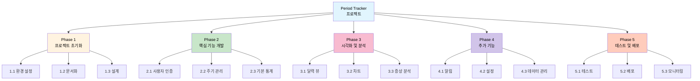
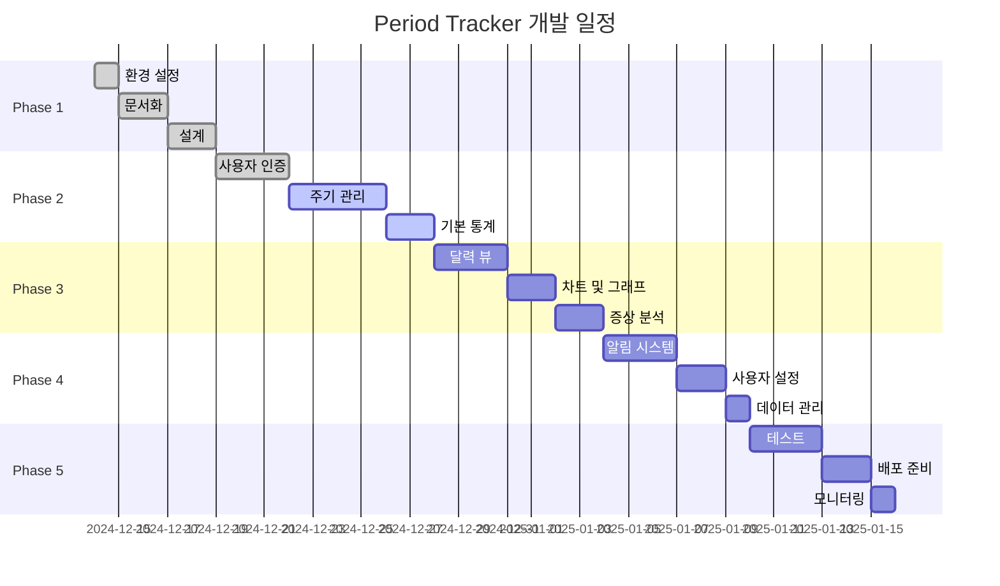
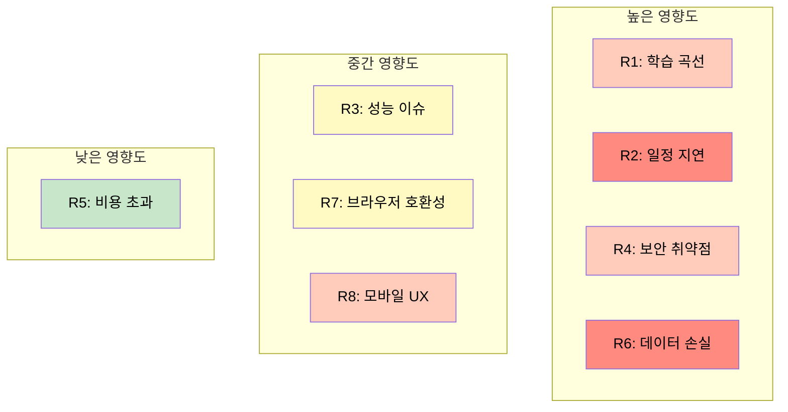
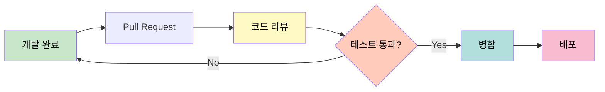

# Period Tracker - WBS (Work Breakdown Structure)

## 작업 분해 구조

> 여성 월경 주기 관리 서비스 개발을 위한 상세 작업 분해 구조입니다.

---

## 목차
1. [프로젝트 개요](#1-프로젝트-개요)
2. [WBS 계층 구조](#2-wbs-계층-구조)
3. [Phase 1: 프로젝트 초기화](#3-phase-1-프로젝트-초기화)
4. [Phase 2: 핵심 기능 개발](#4-phase-2-핵심-기능-개발)
5. [Phase 3: 시각화 및 분석](#5-phase-3-시각화-및-분석)
6. [Phase 4: 추가 기능](#6-phase-4-추가-기능)
7. [Phase 5: 테스트 및 배포](#7-phase-5-테스트-및-배포)
8. [일정 관리](#8-일정-관리)
9. [리스크 관리](#9-리스크-관리)

---

## 1. 프로젝트 개요

### 1.1 프로젝트 정보

| 항목 | 내용 |
|------|------|
| **프로젝트명** | Period Tracker - 여성 월경 주기 관리 서비스 |
| **목표** | MVP 완성 및 베타 서비스 런칭 |
| **기간** | 6주 (42일) |
| **팀 구성** | 풀스택 개발자 1명 |
| **예산** | 개발 인건비 + 인프라 비용 |

### 1.2 주요 산출물

- [x] 프로젝트 초기 설정
- [x] README.md
- [x] SETUP.md (설정 가이드)
- [x] MVP_SPEC.md (기능 명세서)
- [x] ARCHITECTURE.md (아키텍처 문서)
- [ ] WBS.md (작업 분해 구조)
- [ ] 백엔드 API (Spring Boot + Kotlin)
- [ ] 프론트엔드 웹앱 (Next.js + React)
- [ ] 데이터베이스 스키마 (PostgreSQL)
- [ ] API 문서 (Swagger)
- [ ] 테스트 코드
- [ ] 배포 스크립트

---

## 2. WBS 계층 구조

### 2.1 전체 프로젝트 구조도

### 2.2 작업 코드 체계

| Level | 코드 형식 | 예시 | 설명 |
|-------|----------|------|------|
| 1 | P{n} | P1 | Phase (단계) |
| 2 | P{n}.{m} | P1.1 | 주요 작업 그룹 |
| 3 | P{n}.{m}.{k} | P1.1.1 | 세부 작업 |

---

## 3. Phase 1: 프로젝트 초기화

**기간**: 1주 (완료)
**상태**: ✅ 100% 완료

### 3.1 환경 설정 (P1.1)

| 작업 ID | 작업명 | 담당 | 공수 | 상태 | 산출물 |
|---------|--------|------|------|------|--------|
| P1.1.1 | 프로젝트 디렉토리 생성 | Dev | 0.5h | ✅ | 디렉토리 구조 |
| P1.1.2 | 백엔드 Gradle 설정 | Dev | 2h | ✅ | build.gradle.kts |
| P1.1.3 | 프론트엔드 Next.js 설정 | Dev | 2h | ✅ | package.json |
| P1.1.4 | Docker Compose 설정 | Dev | 1h | ✅ | docker-compose.yml |
| P1.1.5 | 환경 변수 설정 | Dev | 1h | ✅ | .env 파일들 |

**총 공수**: 6.5시간
**의존성**: 없음

### 3.2 문서화 (P1.2)

| 작업 ID | 작업명 | 담당 | 공수 | 상태 | 산출물 |
|---------|--------|------|------|------|--------|
| P1.2.1 | README 작성 | Dev | 1h | ✅ | README.md |
| P1.2.2 | 설정 가이드 작성 | Dev | 2h | ✅ | SETUP.md |
| P1.2.3 | MVP 기능 명세 작성 | Dev | 3h | ✅ | MVP_SPEC.md |
| P1.2.4 | 아키텍처 문서 작성 | Dev | 4h | ✅ | ARCHITECTURE.md |
| P1.2.5 | WBS 작성 | Dev | 2h | 🔄 | WBS.md |

**총 공수**: 12시간
**의존성**: P1.1

### 3.3 설계 (P1.3)

| 작업 ID | 작업명 | 담당 | 공수 | 상태 | 산출물 |
|---------|--------|------|------|------|--------|
| P1.3.1 | 데이터베이스 ERD 설계 | Dev | 3h | ✅ | ERD 다이어그램 |
| P1.3.2 | API 엔드포인트 설계 | Dev | 2h | ✅ | API 명세 |
| P1.3.3 | UI/UX 와이어프레임 | Dev | 3h | ⏳ | Figma/스케치 |
| P1.3.4 | 컴포넌트 구조 설계 | Dev | 2h | ✅ | 컴포넌트 트리 |

**총 공수**: 10시간
**의존성**: P1.2

---

## 4. Phase 2: 핵심 기능 개발

**기간**: 2주
**상태**: 🔄 60% 완료

### 4.1 사용자 인증 (P2.1)

#### 백엔드 작업

| 작업 ID | 작업명 | 담당 | 공수 | 상태 | 산출물 |
|---------|--------|------|------|------|--------|
| P2.1.1 | User 엔티티 생성 | Dev | 1h | ✅ | User.kt |
| P2.1.2 | UserRepository 구현 | Dev | 0.5h | ✅ | UserRepository.kt |
| P2.1.3 | JWT 설정 | Dev | 2h | ✅ | JwtProperties.kt, JwtTokenProvider.kt |
| P2.1.4 | Spring Security 설정 | Dev | 3h | ✅ | SecurityConfig.kt |
| P2.1.5 | 회원가입 API | Dev | 2h | ✅ | POST /api/auth/register |
| P2.1.6 | 로그인 API | Dev | 1.5h | ✅ | POST /api/auth/login |
| P2.1.7 | JWT 필터 구현 | Dev | 2h | ✅ | JwtAuthenticationFilter.kt |

**소계**: 12시간

#### 프론트엔드 작업

| 작업 ID | 작업명 | 담당 | 공수 | 상태 | 산출물 |
|---------|--------|------|------|------|--------|
| P2.1.8 | Auth Store 구현 | Dev | 2h | ✅ | authStore.ts |
| P2.1.9 | API 클라이언트 설정 | Dev | 1.5h | ✅ | api.ts |
| P2.1.10 | 로그인 페이지 | Dev | 3h | ✅ | app/login/page.tsx |
| P2.1.11 | 회원가입 페이지 | Dev | 3h | ✅ | app/register/page.tsx |
| P2.1.12 | 폼 검증 (Zod) | Dev | 1.5h | ✅ | 스키마 정의 |
| P2.1.13 | 인증 가드 | Dev | 1h | ✅ | 리다이렉션 로직 |

**소계**: 12시간

**총 공수 (P2.1)**: 24시간
**의존성**: P1.3

---

### 4.2 주기 관리 (P2.2)

#### 백엔드 작업

| 작업 ID | 작업명 | 담당 | 공수 | 상태 | 산출물 |
|---------|--------|------|------|------|--------|
| P2.2.1 | Cycle 엔티티 생성 | Dev | 2h | ✅ | Cycle.kt |
| P2.2.2 | CycleRepository 구현 | Dev | 1h | ✅ | CycleRepository.kt |
| P2.2.3 | CycleService 구현 | Dev | 4h | ✅ | CycleService.kt |
| P2.2.4 | 주기 생성 API | Dev | 2h | ⏳ | POST /api/cycles |
| P2.2.5 | 주기 목록 조회 API | Dev | 1h | ✅ | GET /api/cycles |
| P2.2.6 | 주기 상세 조회 API | Dev | 1h | ✅ | GET /api/cycles/{id} |
| P2.2.7 | 주기 수정 API | Dev | 2h | ⏳ | PUT /api/cycles/{id} |
| P2.2.8 | 주기 삭제 API | Dev | 1h | ⏳ | DELETE /api/cycles/{id} |

**소계**: 14시간

#### 프론트엔드 작업

| 작업 ID | 작업명 | 담당 | 공수 | 상태 | 산출물 |
|---------|--------|------|------|------|--------|
| P2.2.9 | Cycle Store 구현 | Dev | 2h | ✅ | cycleStore.ts |
| P2.2.10 | 주기 추가 모달 | Dev | 4h | ⏳ | CycleModal.tsx |
| P2.2.11 | 주기 수정 모달 | Dev | 2h | ⏳ | EditCycleModal.tsx |
| P2.2.12 | 주기 목록 컴포넌트 | Dev | 3h | ✅ | CycleList.tsx |
| P2.2.13 | 주기 카드 컴포넌트 | Dev | 2h | ✅ | CycleCard.tsx |
| P2.2.14 | 삭제 확인 다이얼로그 | Dev | 1h | ⏳ | DeleteDialog.tsx |

**소계**: 14시간

**총 공수 (P2.2)**: 28시간
**의존성**: P2.1

---

### 4.3 기본 통계 (P2.3)

#### 백엔드 작업

| 작업 ID | 작업명 | 담당 | 공수 | 상태 | 산출물 |
|---------|--------|------|------|------|--------|
| P2.3.1 | 통계 계산 로직 | Dev | 3h | ✅ | CycleService.getStats() |
| P2.3.2 | 평균 주기 계산 | Dev | 1h | ✅ | 알고리즘 구현 |
| P2.3.3 | 다음 예측일 계산 | Dev | 2h | ✅ | 예측 알고리즘 |
| P2.3.4 | 통계 API | Dev | 1h | ✅ | GET /api/cycles/stats |

**소계**: 7시간

#### 프론트엔드 작업

| 작업 ID | 작업명 | 담당 | 공수 | 상태 | 산출물 |
|---------|--------|------|------|------|--------|
| P2.3.5 | 대시보드 레이아웃 | Dev | 2h | ✅ | app/dashboard/page.tsx |
| P2.3.6 | 통계 카드 컴포넌트 | Dev | 2h | ✅ | StatsCard.tsx |
| P2.3.7 | 데이터 로딩 처리 | Dev | 1h | ✅ | 로딩 스피너 |
| P2.3.8 | 빈 상태 UI | Dev | 1h | ⏳ | EmptyState.tsx |

**소계**: 6시간

**총 공수 (P2.3)**: 13시간
**의존성**: P2.2

---

## 5. Phase 3: 시각화 및 분석

**기간**: 2주
**상태**: ⏳ 대기 중

### 5.1 달력 뷰 (P3.1)

| 작업 ID | 작업명 | 담당 | 공수 | 상태 | 산출물 |
|---------|--------|------|------|------|--------|
| P3.1.1 | 달력 라이브러리 선정 | Dev | 1h | ⏳ | 기술 조사 문서 |
| P3.1.2 | 달력 컴포넌트 구조 | Dev | 2h | ⏳ | Calendar.tsx |
| P3.1.3 | 월별 네비게이션 | Dev | 2h | ⏳ | 이전/다음 달 |
| P3.1.4 | 주기 데이터 표시 | Dev | 3h | ⏳ | 날짜별 하이라이트 |
| P3.1.5 | 예상 주기 표시 | Dev | 2h | ⏳ | 예측 날짜 스타일링 |
| P3.1.6 | 날짜 클릭 이벤트 | Dev | 2h | ⏳ | 상세 보기 연동 |
| P3.1.7 | 반응형 디자인 | Dev | 2h | ⏳ | 모바일 최적화 |

**총 공수**: 14시간
**의존성**: P2.3

---

### 5.2 차트 및 그래프 (P3.2)

| 작업 ID | 작업명 | 담당 | 공수 | 상태 | 산출물 |
|---------|--------|------|------|------|--------|
| P3.2.1 | Recharts 설정 | Dev | 1h | ⏳ | 라이브러리 설치 |
| P3.2.2 | 주기 길이 추세 차트 | Dev | 3h | ⏳ | LineChart.tsx |
| P3.2.3 | 평균선 표시 | Dev | 1h | ⏳ | 통계 라인 추가 |
| P3.2.4 | 툴팁 커스터마이징 | Dev | 2h | ⏳ | CustomTooltip.tsx |
| P3.2.5 | 차트 범례 | Dev | 1h | ⏳ | Legend 구현 |
| P3.2.6 | 데이터 필터링 | Dev | 2h | ⏳ | 기간 선택 UI |

**총 공수**: 10시간
**의존성**: P2.3

---

### 5.3 증상 분석 (P3.3)

#### 백엔드 작업

| 작업 ID | 작업명 | 담당 | 공수 | 상태 | 산출물 |
|---------|--------|------|------|------|--------|
| P3.3.1 | 증상 빈도 계산 | Dev | 2h | ⏳ | 통계 로직 |
| P3.3.2 | 증상 트렌드 분석 | Dev | 2h | ⏳ | 시간별 분석 |

**소계**: 4시간

#### 프론트엔드 작업

| 작업 ID | 작업명 | 담당 | 공수 | 상태 | 산출물 |
|---------|--------|------|------|------|--------|
| P3.3.3 | 증상 빈도 차트 | Dev | 3h | ⏳ | BarChart.tsx |
| P3.3.4 | 상위 증상 표시 | Dev | 2h | ⏳ | TopSymptoms.tsx |
| P3.3.5 | 증상 필터 | Dev | 2h | ⏳ | SymptomFilter.tsx |

**소계**: 7시간

**총 공수 (P3.3)**: 11시간
**의존성**: P2.3

---

## 6. Phase 4: 추가 기능

**기간**: 1.5주
**상태**: ⏳ 대기 중

### 6.1 알림 시스템 (P4.1)

#### 백엔드 작업

| 작업 ID | 작업명 | 담당 | 공수 | 상태 | 산출물 |
|---------|--------|------|------|------|--------|
| P4.1.1 | 알림 엔티티 생성 | Dev | 1h | ⏳ | Notification.kt |
| P4.1.2 | 알림 스케줄러 | Dev | 4h | ⏳ | Scheduler 구현 |
| P4.1.3 | 이메일 서비스 연동 | Dev | 3h | ⏳ | EmailService.kt |
| P4.1.4 | 알림 설정 API | Dev | 2h | ⏳ | NotificationSettings API |

**소계**: 10시간

#### 프론트엔드 작업

| 작업 ID | 작업명 | 담당 | 공수 | 상태 | 산출물 |
|---------|--------|------|------|------|--------|
| P4.1.5 | 브라우저 푸시 권한 요청 | Dev | 2h | ⏳ | Push API |
| P4.1.6 | 알림 설정 페이지 | Dev | 3h | ⏳ | settings/notifications |
| P4.1.7 | 알림 토글 UI | Dev | 1h | ⏳ | Toggle 컴포넌트 |

**소계**: 6시간

**총 공수 (P4.1)**: 16시간
**의존성**: P3.1

---

### 6.2 사용자 설정 (P4.2)

| 작업 ID | 작업명 | 담당 | 공수 | 상태 | 산출물 |
|---------|--------|------|------|------|--------|
| P4.2.1 | 프로필 조회 API | Dev | 1h | ⏳ | GET /api/users/profile |
| P4.2.2 | 프로필 수정 API | Dev | 2h | ⏳ | PUT /api/users/profile |
| P4.2.3 | 비밀번호 변경 API | Dev | 2h | ⏳ | PUT /api/users/password |
| P4.2.4 | 프로필 페이지 | Dev | 3h | ⏳ | settings/profile |
| P4.2.5 | 비밀번호 변경 페이지 | Dev | 2h | ⏳ | settings/password |
| P4.2.6 | 계정 삭제 기능 | Dev | 2h | ⏳ | 삭제 확인 플로우 |

**총 공수**: 12시간
**의존성**: P2.1

---

### 6.3 데이터 관리 (P4.3)

| 작업 ID | 작업명 | 담당 | 공수 | 상태 | 산출물 |
|---------|--------|------|------|------|--------|
| P4.3.1 | CSV 내보내기 백엔드 | Dev | 3h | ⏳ | Export API |
| P4.3.2 | CSV 내보내기 프론트 | Dev | 2h | ⏳ | Export 버튼 |
| P4.3.3 | 데이터 백업 기능 | Dev | 2h | ⏳ | Backup 로직 |

**총 공수**: 7시간
**의존성**: P2.2

---

## 7. Phase 5: 테스트 및 배포

**기간**: 1주
**상태**: ⏳ 대기 중

### 7.1 테스트 (P5.1)

#### 백엔드 테스트

| 작업 ID | 작업명 | 담당 | 공수 | 상태 | 산출물 |
|---------|--------|------|------|------|--------|
| P5.1.1 | Unit Test - Auth | Dev | 3h | ⏳ | AuthServiceTest.kt |
| P5.1.2 | Unit Test - Cycle | Dev | 4h | ⏳ | CycleServiceTest.kt |
| P5.1.3 | Integration Test - API | Dev | 4h | ⏳ | API 통합 테스트 |
| P5.1.4 | Repository Test | Dev | 2h | ⏳ | Repository 테스트 |

**소계**: 13시간

#### 프론트엔드 테스트

| 작업 ID | 작업명 | 담당 | 공수 | 상태 | 산출물 |
|---------|--------|------|------|------|--------|
| P5.1.5 | Component Test | Dev | 4h | ⏳ | Jest + RTL |
| P5.1.6 | Store Test | Dev | 2h | ⏳ | Zustand 테스트 |
| P5.1.7 | E2E Test | Dev | 4h | ⏳ | Playwright |

**소계**: 10시간

**총 공수 (P5.1)**: 23시간
**의존성**: P4.3

---

### 7.2 배포 준비 (P5.2)

| 작업 ID | 작업명 | 담당 | 공수 | 상태 | 산출물 |
|---------|--------|------|------|------|--------|
| P5.2.1 | Docker 이미지 생성 | Dev | 3h | ⏳ | Dockerfile |
| P5.2.2 | Docker Compose 프로덕션 | Dev | 2h | ⏳ | docker-compose.prod.yml |
| P5.2.3 | 환경 변수 관리 | Dev | 1h | ⏳ | .env.production |
| P5.2.4 | CI/CD 파이프라인 | Dev | 4h | ⏳ | GitHub Actions |
| P5.2.5 | 프로덕션 DB 마이그레이션 | Dev | 2h | ⏳ | Flyway/Liquibase |
| P5.2.6 | SSL 인증서 설정 | Dev | 2h | ⏳ | Let's Encrypt |

**총 공수**: 14시간
**의존성**: P5.1

---

### 7.3 모니터링 및 로깅 (P5.3)

| 작업 ID | 작업명 | 담당 | 공수 | 상태 | 산출물 |
|---------|--------|------|------|------|--------|
| P5.3.1 | 로깅 설정 | Dev | 2h | ⏳ | Logback 설정 |
| P5.3.2 | 에러 트래킹 | Dev | 2h | ⏳ | Sentry 연동 |
| P5.3.3 | 성능 모니터링 | Dev | 2h | ⏳ | APM 설정 |
| P5.3.4 | 헬스 체크 엔드포인트 | Dev | 1h | ⏳ | /actuator/health |

**총 공수**: 7시간
**의존성**: P5.2

---

## 8. 일정 관리

### 8.1 전체 일정 (간트 차트)

### 8.2 마일스톤

| 마일스톤 | 완료 조건 | 목표일 | 상태 |
|----------|----------|--------|------|
| M1: 프로젝트 초기화 | 개발 환경 및 문서 완성 | 2024-12-20 | ✅ 완료 |
| M2: 핵심 기능 완성 | 인증, 주기 CRUD, 통계 | 2024-12-28 | 🔄 진행 중 |
| M3: MVP 기능 완성 | 달력, 차트, 분석 | 2025-01-04 | ⏳ 대기 |
| M4: 추가 기능 완성 | 알림, 설정, 데이터 관리 | 2025-01-10 | ⏳ 대기 |
| M5: 베타 런칭 | 테스트 및 배포 완료 | 2025-01-16 | ⏳ 대기 |

### 8.3 공수 요약

| Phase | 총 공수 | 진행률 | 상태 |
|-------|---------|--------|------|
| Phase 1: 초기화 | 28.5h | 100% | ✅ 완료 |
| Phase 2: 핵심 기능 | 65h | 60% | 🔄 진행 중 |
| Phase 3: 시각화 | 35h | 0% | ⏳ 대기 |
| Phase 4: 추가 기능 | 35h | 0% | ⏳ 대기 |
| Phase 5: 테스트/배포 | 44h | 0% | ⏳ 대기 |
| **총계** | **207.5시간** | **22%** | - |

**예상 완료일**: 2025년 1월 16일 (약 26일 소요)

---

## 9. 리스크 관리

### 9.1 식별된 리스크

| ID | 리스크 | 영향도 | 발생 확률 | 대응 전략 | 담당 |
|----|--------|--------|----------|----------|------|
| R1 | 기술 스택 학습 곡선 | 높음 | 중간 | 사전 학습, 레퍼런스 확보 | Dev |
| R2 | 일정 지연 | 높음 | 높음 | 버퍼 시간 확보, 우선순위 조정 | PM |
| R3 | API 성능 이슈 | 중간 | 낮음 | 성능 테스트, 쿼리 최적화 | Dev |
| R4 | 보안 취약점 | 높음 | 중간 | 코드 리뷰, 보안 감사 | Dev |
| R5 | 인프라 비용 초과 | 낮음 | 낮음 | 비용 모니터링, 자동 스케일링 | DevOps |
| R6 | 데이터 손실 | 높음 | 낮음 | 자동 백업, 복구 테스트 | DevOps |
| R7 | 브라우저 호환성 | 중간 | 중간 | Cross-browser 테스트 | Dev |
| R8 | 모바일 UX 문제 | 중간 | 높음 | 반응형 디자인 테스트 | Dev |

### 9.2 리스크 매트릭스

---

## 10. 품질 관리

### 10.1 코드 품질 기준

| 항목 | 목표 | 측정 방법 |
|------|------|----------|
| 테스트 커버리지 | > 80% | JaCoCo (Backend), Jest (Frontend) |
| 코드 복잡도 | < 10 | SonarQube |
| 중복 코드 | < 3% | SonarQube |
| 정적 분석 | 0 Critical | ESLint, Detekt |
| API 응답 시간 | < 200ms | JMeter |

### 10.2 리뷰 프로세스

---

## 11. 의사소통 계획

### 11.1 보고 체계

| 보고서 | 주기 | 내용 |
|--------|------|------|
| 일일 스탠드업 | 매일 | 진행 사항, 이슈, 계획 |
| 주간 리포트 | 매주 금요일 | 완료 작업, 다음 주 계획, 리스크 |
| 마일스톤 리뷰 | 마일스톤 완료 시 | 성과, 교훈, 개선점 |

### 11.2 이슈 관리

| 우선순위 | SLA | 설명 |
|----------|-----|------|
| Critical | 4시간 | 서비스 중단 |
| High | 1일 | 주요 기능 장애 |
| Medium | 3일 | 부분 기능 문제 |
| Low | 1주 | 개선 사항 |

---

## 12. 변경 관리

### 12.1 변경 요청 프로세스

1. **변경 요청 제출** - 이유, 영향도, 우선순위 포함
2. **영향 분석** - 일정, 비용, 리스크 평가
3. **승인/거부** - 의사결정
4. **구현** - WBS 업데이트 및 실행
5. **검증** - 변경 사항 확인

### 12.2 버전 관리

| 버전 | 날짜 | 변경 사항 | 작성자 |
|------|------|----------|--------|
| 1.0 | 2024-12-21 | 초기 WBS 작성 | Dev Team |

---

## 13. 성공 기준

### 13.1 기술적 성공 기준

- [ ] 모든 P0 기능 구현 완료
- [ ] 테스트 커버리지 80% 이상
- [ ] API 응답 시간 평균 200ms 이하
- [ ] 치명적 버그 0건
- [ ] 보안 취약점 0건

### 13.2 비즈니스 성공 기준

- [ ] 베타 테스터 50명 확보
- [ ] 사용자 만족도 4.0/5.0 이상
- [ ] 일일 활성 사용자(DAU) 30명 이상
- [ ] 평균 세션 시간 5분 이상
- [ ] 주기 기록 완료율 70% 이상

---

## 부록

### A. 용어 정의

| 용어 | 정의 |
|------|------|
| WBS | Work Breakdown Structure (작업 분해 구조) |
| MVP | Minimum Viable Product (최소 기능 제품) |
| DAU | Daily Active Users (일일 활성 사용자) |
| SLA | Service Level Agreement (서비스 수준 협약) |
| APM | Application Performance Monitoring |

### B. 참조 문서

- README.md - 프로젝트 개요
- SETUP.md - 설정 가이드
- MVP_SPEC.md - 기능 명세서
- ARCHITECTURE.md - 아키텍처 문서

---

## 문서 정보

- **버전**: 1.0
- **작성일**: 2024-12-21
- **최종 수정일**: 2024-12-21
- **작성자**: Period Tracker 개발팀
- **검토자**: -
- **승인자**: -
