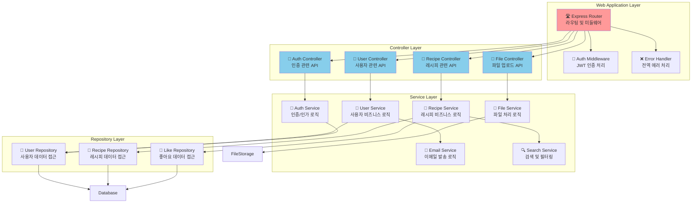
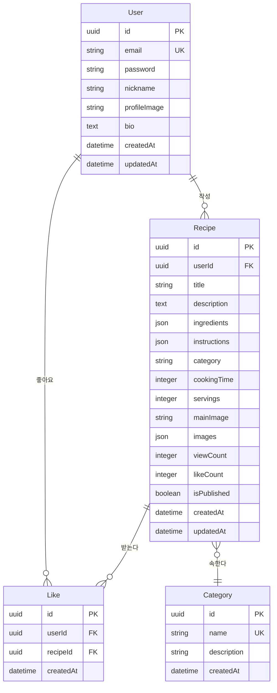
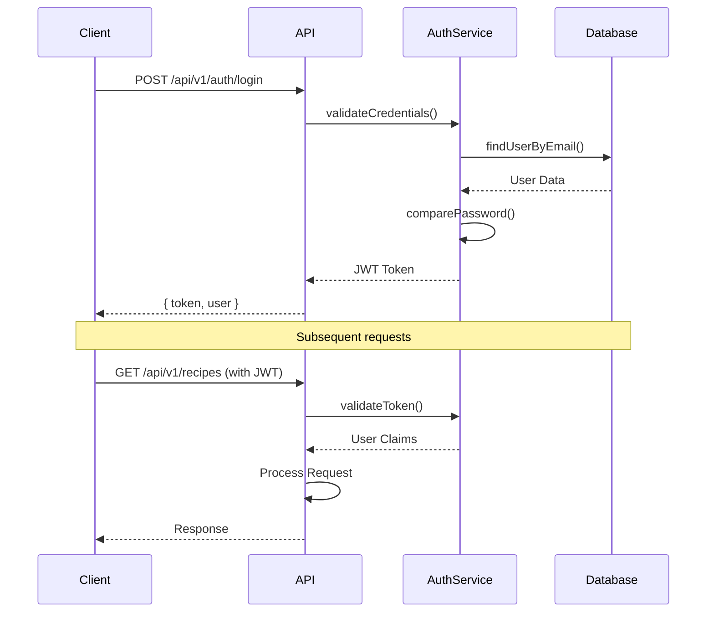
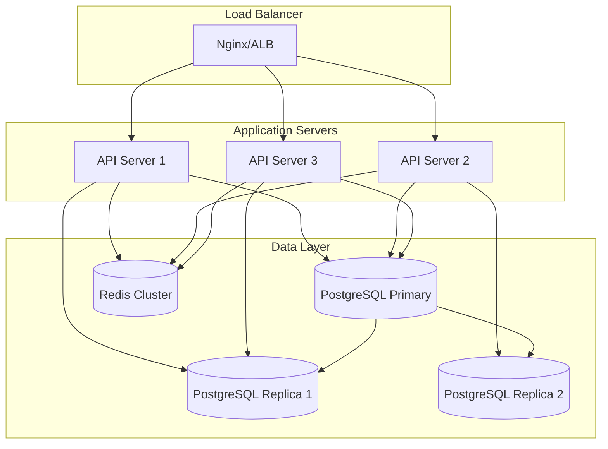
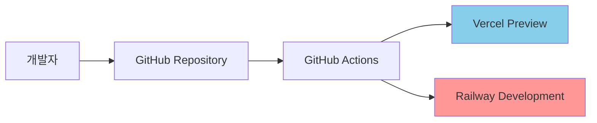
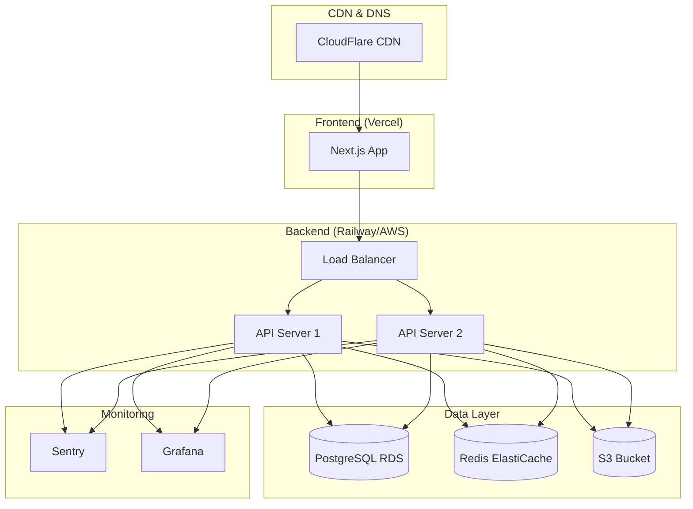
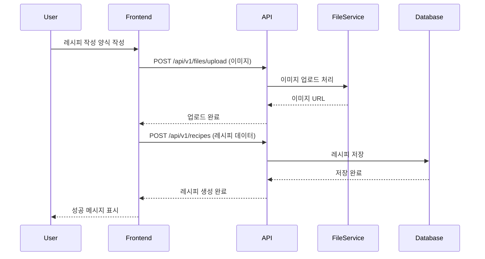
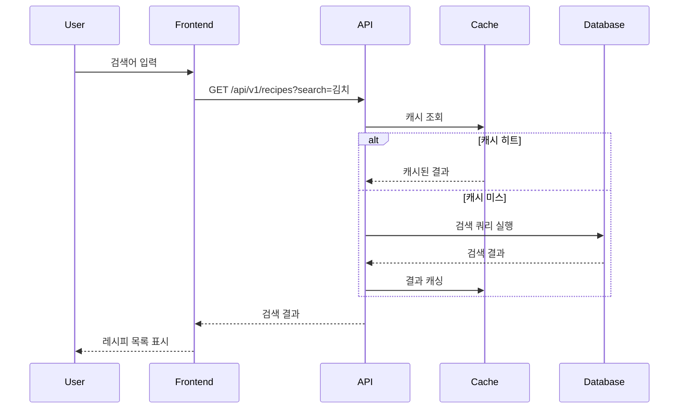
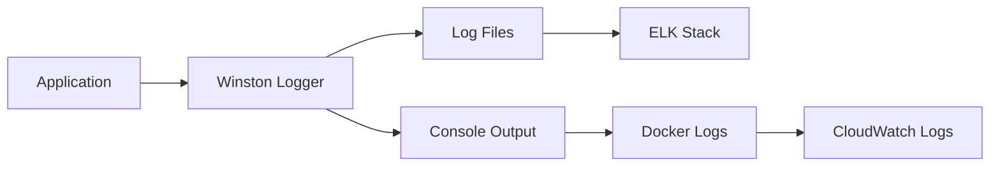

# CookShare 시스템 아키텍처 문서

## 개요

본 문서는 CookShare 레시피 공유 플랫폼의 시스템 아키텍처를 C4 모델(Context, Container, Component, Code)을 사용하여 설명합니다.

---

## C4 모델 다이어그램

### Level 1: System Context Diagram

```mermaid
graph TB
    User[👤 사용자<br/>레시피를 공유하고<br/>탐색하는 일반 사용자]
    Admin[👨‍💼 관리자<br/>시스템 관리 및<br/>콘텐츠 관리]
    CookShare[🍳 CookShare System<br/>레시피 공유 및<br/>커뮤니티 플랫폼]
    EmailService[📧 이메일 서비스<br/>인증 및 알림]
    FileStorage[📁 파일 저장소<br/>이미지 및 미디어]
    Analytics[📊 분석 서비스<br/>사용자 행동 분석]

    User --> CookShare : 레시피 CRUD, 검색, 좋아요
    Admin --> CookShare : 시스템 관리, 콘텐츠 관리
    CookShare --> EmailService : 회원가입 인증, 알림 발송
    CookShare --> FileStorage : 이미지 업로드/다운로드
    CookShare --> Analytics : 사용자 행동 데이터 전송

    style CookShare fill:#ff9999
    style User fill:#87ceeb
    style Admin fill:#98fb98
```

### Level 2: Container Diagram

```mermaid
graph TB
    subgraph "External Systems"
        EmailService[📧 Email Service<br/>SendGrid/AWS SES]
        FileStorage[📁 File Storage<br/>AWS S3/Cloudinary]
        Analytics[📊 Analytics<br/>Google Analytics]
    end

    subgraph "CookShare System"
        WebApp[🌐 Web Application<br/>React + TypeScript<br/>사용자 인터페이스]
        API[⚙️ API Application<br/>Node.js + Express<br/>비즈니스 로직 처리]
        Database[🗄️ Database<br/>PostgreSQL<br/>사용자 및 레시피 데이터]
        Cache[⚡ Cache<br/>Redis<br/>세션 및 임시 데이터]
    end

    User[👤 사용자] --> WebApp : HTTPS
    Admin[👨‍💼 관리자] --> WebApp : HTTPS

    WebApp --> API : REST API<br/>JSON over HTTPS
    API --> Database : SQL Queries<br/>TCP/5432
    API --> Cache : Key-Value Store<br/>TCP/6379
    API --> EmailService : SMTP/API
    API --> FileStorage : HTTP API
    API --> Analytics : HTTP API

    style WebApp fill:#87ceeb
    style API fill:#ff9999
    style Database fill:#98fb98
    style Cache fill:#ffd700
```

### Level 3: Component Diagram - API Application



### Level 4: Database Schema Diagram



---

## 기술 스택

### Frontend

- **Framework**: React 18 + TypeScript
- **Styling**: Tailwind CSS + Headless UI
- **State Management**: Zustand 또는 React Query
- **Build Tool**: Vite
- **Package Manager**: pnpm

### Backend

- **Runtime**: Node.js 18+
- **Framework**: Express.js + TypeScript
- **ORM**: Prisma
- **Authentication**: JWT + bcrypt
- **Validation**: Zod
- **File Upload**: Multer + Sharp (이미지 처리)

### Database & Storage

- **Primary DB**: PostgreSQL 15
- **Cache**: Redis 7
- **File Storage**: AWS S3 또는 Cloudinary
- **Search**: PostgreSQL Full-Text Search

### DevOps & Deployment

- **Containerization**: Docker + Docker Compose
- **CI/CD**: GitHub Actions
- **Frontend Hosting**: Vercel
- **Backend Hosting**: Railway 또는 AWS ECS
- **Monitoring**: Sentry + Winston (로깅)

---

## 아키텍처 패턴 및 설계 원칙

### 1. 레이어드 아키텍처

```
┌─────────────────┐
│   Presentation  │ ← Controllers, Middleware
├─────────────────┤
│    Business     │ ← Services, Domain Logic
├─────────────────┤
│   Data Access   │ ← Repositories, ORM
├─────────────────┤
│   Infrastructure│ ← Database, External APIs
└─────────────────┘
```

### 2. 설계 원칙

- **Single Responsibility**: 각 모듈은 단일 책임을 가짐
- **Dependency Injection**: 의존성 주입을 통한 결합도 감소
- **Interface Segregation**: 필요한 메서드만 노출
- **Open/Closed**: 확장에는 열려있고 수정에는 닫혀있음

### 3. API 설계 원칙

- **RESTful API**: 자원 중심의 URL 설계
- **Stateless**: 상태를 유지하지 않는 API
- **HATEOAS**: 응답에 관련 링크 포함
- **Versioning**: API 버전 관리 (/api/v1/)

---

## 보안 아키텍처

### 인증 및 인가



### 보안 조치

- **JWT 토큰**: Access Token (15분) + Refresh Token (7일)
- **Password Hashing**: bcrypt (salt rounds: 12)
- **Rate Limiting**: Express-rate-limit (100 req/15min)
- **CORS**: 허용된 도메인만 접근 가능
- **Helmet.js**: 보안 헤더 설정
- **Input Validation**: Zod 스키마 검증
- **SQL Injection 방지**: Prisma ORM 사용

---

## 성능 최적화 전략

### 1. 캐싱 전략

```mermaid
graph LR
    Client[클라이언트]
    CDN[CDN Cache]
    Server[서버]
    Redis[Redis Cache]
    DB[PostgreSQL]

    Client --> CDN : 정적 파일
    Client --> Server : API 요청
    Server --> Redis : 캐시 조회
    Redis -.-> Server : 캐시 히트
    Server --> DB : 캐시 미스
    DB --> Server : 데이터
    Server --> Redis : 캐시 저장
    Server --> Client : 응답
```

### 2. 데이터베이스 최적화

- **인덱싱**: 자주 조회되는 컬럼에 인덱스 생성
- **페이지네이션**: Cursor 기반 페이징으로 성능 향상
- **Connection Pooling**: PgPool 사용
- **Query Optimization**: N+1 문제 방지, Eager Loading

### 3. Frontend 최적화

- **Code Splitting**: 라우트별 번들 분할
- **Image Optimization**: WebP 포맷, Lazy Loading
- **Virtual Scrolling**: 대용량 리스트 최적화
- **Caching**: React Query로 API 응답 캐싱

---

## 확장성 고려사항

### 1. 수직 확장 (Scale Up)

- **서버 리소스**: CPU, Memory 증설
- **데이터베이스**: PostgreSQL 인스턴스 업그레이드
- **캐시**: Redis 메모리 증설

### 2. 수평 확장 (Scale Out)



### 3. 마이크로서비스 전환 고려사항

미래 확장 시 고려할 서비스 분할:

- **User Service**: 사용자 관리, 인증
- **Recipe Service**: 레시피 CRUD, 검색
- **Interaction Service**: 좋아요, 댓글, 팔로우
- **Notification Service**: 이메일, 푸시 알림
- **Analytics Service**: 사용자 행동 분석

---

## 배포 아키텍처

### Development Environment



### Production Environment



---

## API 스펙 예시

### Authentication APIs

```typescript
// POST /api/v1/auth/register
{
  "email": "user@example.com",
  "password": "password123",
  "nickname": "요리사"
}

// Response
{
  "success": true,
  "data": {
    "user": {
      "id": "uuid",
      "email": "user@example.com",
      "nickname": "요리사"
    },
    "tokens": {
      "accessToken": "jwt_token",
      "refreshToken": "refresh_token"
    }
  }
}
```

### Recipe APIs

```typescript
// GET /api/v1/recipes?page=1&limit=12&category=한식&search=김치
{
  "success": true,
  "data": {
    "recipes": [...],
    "pagination": {
      "currentPage": 1,
      "totalPages": 5,
      "totalCount": 56,
      "hasNext": true
    }
  }
}

// POST /api/v1/recipes
{
  "title": "김치찌개 레시피",
  "description": "매콤한 김치찌개",
  "ingredients": [
    { "name": "김치", "amount": "300g" },
    { "name": "돼지고기", "amount": "200g" }
  ],
  "instructions": [
    { "step": 1, "content": "김치를 썰어준다" },
    { "step": 2, "content": "고기를 볶는다" }
  ],
  "category": "한식",
  "cookingTime": 30,
  "servings": 2
}
```

---

## 데이터 플로우

### 레시피 작성 플로우



### 레시피 검색 플로우



---

## 모니터링 및 로깅

### 애플리케이션 메트릭

- **성능**: 응답 시간, 처리량(TPS)
- **에러**: 에러율, 예외 발생 횟수
- **비즈니스**: 레시피 작성 수, 사용자 활동
- **인프라**: CPU, 메모리, 디스크 사용률

### 로그 수집 전략



### 알림 설정

- **Critical**: 서버 다운, 데이터베이스 연결 실패
- **Warning**: 높은 응답 시간, 에러율 증가
- **Info**: 배포 완료, 새로운 사용자 가입

---

## 결론

CookShare 아키텍처는 MVP 단계에서는 모노리스 구조로 시작하되, 확장 가능성을 고려한 레이어드 아키텍처를 채택했습니다. 사용자 증가에 따라 마이크로서비스로의 전환이 용이하도록 설계되었으며, 현대적인 기술 스택과 모범 사례를 적용하여 안정성과 성능을 보장합니다.

주요 특징:

- **확장 가능한 모노리스**: 초기 개발 속도와 미래 확장성의 균형
- **타입 안전성**: TypeScript 전면 적용으로 런타임 에러 방지
- **성능 최적화**: 다층 캐싱과 데이터베이스 최적화
- **보안 중심**: JWT 인증, 입력 검증, 보안 헤더 적용
- **DevOps 친화적**: 컨테이너화, CI/CD, 모니터링 완비

이 아키텍처를 기반으로 안정적이고 확장 가능한 레시피 공유 플랫폼을 구축할 수 있습니다.
